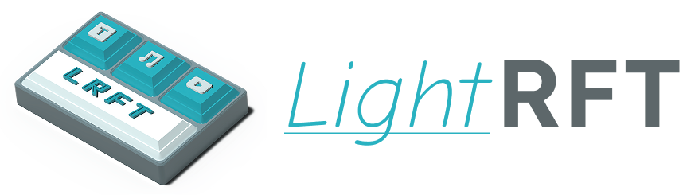

# LightRFT

<div align="center">



**Light, Efficient, Omni-modal & Reward-model Driven Reinforcement Fine-Tuning Framework**

[](https://github.com/opendilab/lightrft)
[](https://www.python.org/downloads/)
[](https://pytorch.org/)
[](LICENSE)

English | [简体中文](README_zh.md)

</div>

---

## 📖 Introduction

**LightRFT** (Light Reinforcement Fine-Tuning) is an advanced reinforcement learning fine-tuning framework designed for Large Language Models (LLMs) and Vision-Language Models (VLMs). This framework provides efficient and scalable RLHF (Reinforcement Learning from Human Feedback) and RLVR training capabilities, supporting multiple state-of-the-art algorithms and distributed training strategies.

### ✨ Key Features

- 🚀 **High-Performance Inference Engines**
  - Integrated vLLM and SGLang for efficient sampling and inference
  - FP8 inference optimization for significantly reduced latency and memory usage
  - Flexible engine sleep/wake mechanisms for optimal resource utilization

- 🧠 **Rich Algorithm Ecosystem**
  - **Policy Optimization**: GRPO, CPGD, DAPO components, high-entropy token filtering
  - **Experimental interfaces**: GSPO and REINFORCE++ are exposed by the CLI but are not fully wired end to end; GMPO and Dr.GRPO remain work in progress
  - **Reward Processing**: Reward Norm/Clip
  - **Sampling Strategy**: FIRE Sampling, Token-Level Policy
  - **Stability Enhancement**: DAPO, select_high_entropy_tokens

- 🔧 **Flexible Training Strategies**
  - FSDP (Fully Sharded Data Parallel) v2 support
  - DeepSpeed ZeRO (Stage 1/2/3) support
  - Gradient checkpointing and mixed precision training (BF16/FP16)
  - Adam Offload and memory optimization techniques

- 🎯 **Innovative Resource Collaboration**
  - **Colocate Anything**: Co-locate reward models with training models to maximize GPU utilization
    - Support multiple reward models on the same device; local PyTorch reward models are evaluated sequentially
    - Dynamic memory management with automatic training/inference phase switching
    - Reduced cross-device communication overhead for improved end-to-end training efficiency
  - **Balance Anything** 🚧 (Under Development): Intelligent load balancing system
    - Adaptive task scheduling and resource allocation
    - Automatic load balancing for multi-node training
    - Performance optimization for heterogeneous hardware environments

- 🌐 **Comprehensive Multimodal Support**
  - **Native Vision-Language Model (VLM) Training**
    - Support for mainstream VLMs like Qwen-VL
    - Parallel processing of multimodal image-text data
    - Efficient multimodal tokenization and batching
  - **Multimodal Reward Modeling**
    - Support for multiple visual reward models working in collaboration
    - Joint optimization of image understanding and text generation
  - **Complete Vision-Language Alignment Training Pipeline**
    - Optimized for multimodal RLVR/RLHF training
    - Built-in support for vision-language model fine-tuning

- 📊 **Complete Experimental Toolkit**
  - Weights & Biases (W&B) integration
  - Math capability benchmarking (GSM8K, Geo3K, etc.)
  - Trajectory saving and analysis tools
  - Automatic checkpoint management

---

## 🎯 Supported Algorithms

For detailed algorithm descriptions, implementation details, and usage guide, see [Algorithm Documentation](docs/source/quick_start/algorithms.md).

| Algorithm | Type | Key Improvement | Paper |
|-----------|------|-----------------|-------|
| **GRPO** | Policy Optimization | Group normalized advantage estimation |  [arXiv:2402.03300](https://arxiv.org/pdf/2402.03300)  |
| **GSPO (WIP)** | Policy Optimization | Group sequence policy optimization; current CLI path is not fully connected to the policy loss | [arXiv:2507.18071](https://arxiv.org/abs/2507.18071) |
| **GMPO (WIP)** | Policy Optimization | Geometric-mean policy optimization | [arXiv:2507.20673](https://arxiv.org/abs/2507.20673) |
| **Dr.GRPO (WIP)** | Policy Optimization | Length bias mitigation | [arXiv:2503.20783](https://arxiv.org/abs/2503.20783) |
| **DAPO** | Policy Optimization | Decoupled clip and dynamic sampling policy optimization | [arXiv:2503.14476](https://arxiv.org/abs/2503.14476) |
| **REINFORCE++ (WIP)** | Advantage Estimation | Accepted by the CLI, but the calculator factory is not yet connected | [arXiv:2501.03262](https://arxiv.org/abs/2501.03262) |
| **CPGD** | Advantage Estimation | KL-based drift constraint | [arXiv:2505.12504](https://arxiv.org/abs/2505.12504) |
| **FIRE Sampling** | Sampling Strategy | High-temperature first token sampling for improved diversity | [arXiv:2410.21236](https://arxiv.org/abs/2410.21236) |
| **OPD** | Knowledge Distillation | On-policy teacher-student token-level distillation | [Blog](https://thinkingmachines.ai/blog/on-policy-distillation/) |

---

## 🚀 Quick Start

### Requirements

- Python >= 3.12
- CUDA >= 12.8
- PyTorch >= 2.9.1

### Docker Images

We provide pre-built Docker images for easy deployment and consistent environments. You can also build your own images using the provided `Dockerfile` and `Makefile`.

#### Using Pre-built Images

The official Docker images are available on [Docker Hub](https://hub.docker.com/r/opendilab/lightrft). You can pull the latest version using:

```shell
docker pull opendilab/lightrft:v0.1.0
```

To run a container with GPU support:

```shell
docker run --gpus all -it --rm \
    -v /path/to/your/data:/app/data \
    -v /path/to/your/checkpoints:/app/checkpoints \
    opendilab/lightrft:v0.1.0 /bin/bash
```

#### Building Custom Images

If you need to customize the environment or build from a specific branch, you can use the provided `Makefile` to build the image locally.

1. **Prerequisites**: Ensure you have Docker and NVIDIA Container Toolkit installed.
2. **Build the image**:
   ```shell
   # Build the image with the default name (opendilab/lightrft:v${VERSION})
   make dbuild
   ```
   The `IMAGE_NAME` is automatically determined based on the current version of the project. You can also override it:
   ```shell
   make dbuild IMAGE_NAME=your-custom-tag:latest
   ```

3. **Technical Details**:
   - **Base Image**: `nvcr.io/nvidia/pytorch:25.01-py3` (includes PyTorch 2.5+ and CUDA 12.8).
   - **Dependencies**: The build process installs essential components including `vLLM`, `DeepSpeed`, `Flash-Attention`, and `SGLang` in a specific order to ensure stability.
   - **Optimization**: The `Dockerfile` uses multi-layer optimization and environment variables for non-interactive installation.

### Installation

#### Standard Installation

LightRFT installs **SGLang** by default, so the GSM8K/Geo3K demos can run out of the box with the default backend.

```bash
# Clone the repository
git clone https://github.com/opendilab/LightRFT.git
cd LightRFT

# Install LightRFT with the default SGLang backend
pip install -e .
```

**What gets installed**: PyTorch, SGLang, Flash-Attention, Transformers, DeepSpeed, and other core dependencies.

#### Optional: Install vLLM Backend

If you want to run the same demos with vLLM instead of the default SGLang backend:

```bash
# Install vLLM backend on top of the default installation
pip install -e ".[vllm]"
```

You can also install vLLM directly:

```bash
# Install vLLM directly
pip install "vllm>=0.18.1"
```

#### Troubleshooting Flash-Attention Installation

Flash-Attention is included by default but may fail on some systems due to CUDA compatibility. If installation fails, try:

**Option 1: Use pre-built wheels (recommended)**
```bash
# Download the appropriate wheel from https://github.com/Dao-AILab/flash-attention/releases
# Example for CUDA 12.x and PyTorch 2.9:
pip install flash_attn-2.8.3+cu12torch2.9cxx11abiTRUE-cp312-cp312-linux_x86_64.whl
```

**Option 2: Use Docker (easiest)**
```bash
# The official Docker images include all dependencies
docker pull opendilab/lightrft:v0.1.0
```


## 📚 Usage Guide

### Basic Example: GRPO Training

```bash
# Single node, 8 GPU training example
cd LightRFT

# Run GRPO training (GSM8K math reasoning task) with SGLang
ENGINE_TYPE=sglang bash examples/gsm8k_geo3k/run_grpo_gsm8k_qwen2.5_0.5b.sh

# Or switch the same demo to vLLM
ENGINE_TYPE=vllm bash examples/gsm8k_geo3k/run_grpo_gsm8k_qwen2.5_0.5b.sh

# Geo3K geometry problem training (VLM multimodal)
ENGINE_TYPE=sglang bash examples/gsm8k_geo3k/run_grpo_geo3k_qwen2.5_vl_7b.sh
```

For a complete walkthrough including dataset preprocessing, hyperparameter tuning, reward mechanism details, and W&B monitoring, see the [GRPO Training Tutorial (GSM8K & Geo3K)](docs/source/quick_start/grpo_gsm8k_geo3k_tutorial.md).

---

## 🏗️ Project Structure

```
LightRFT/
├── lightrft/                      # Core library
│   ├── strategy/                  # Training & inference strategies
│   │   ├── config.py              # Strategy configuration
│   │   ├── strategy_base.py       # Strategy base class
│   │   ├── strategy.py            # Strategy implementation
│   │   ├── fake_strategy.py       # Fake strategy for testing
│   │   ├── fsdp/                  # FSDP implementation
│   │   ├── deepspeed/             # DeepSpeed implementation
│   │   ├── vllm_utils/            # vLLM utilities
│   │   ├── sglang_utils/          # SGLang utilities
│   │   └── utils/                 # Strategy utilities
│   ├── models/                    # Model definitions
│   │   ├── actor_al.py            # Audio-language model actor
│   │   ├── actor_language.py      # Language model actor
│   │   ├── actor_modality.py      # Modality-agnostic model actor
│   │   ├── actor_vl.py            # Vision-language model actor
│   │   ├── critic_language.py     # Language model critic
│   │   ├── critic_vl.py           # Vision-language model critic
│   │   ├── grm_vl.py              # Generative reward model (Vision-Language)
│   │   ├── srm_al.py              # Scalar reward model (Audio-Language)
│   │   ├── srm_vl.py              # Scalar reward model (Vision-Language)
│   │   ├── loss.py                # Loss functions
│   │   ├── monkey_patch/          # Model adaptation patches for distributed training
│   │   ├── tests/                 # Model tests
│   │   └── utils.py               # Model utilities
│   ├── trainer/                   # Trainer implementations
│   │   ├── ppo_trainer.py         # LLM PPO trainer
│   │   ├── ppo_trainer_vl.py      # VLM PPO trainer
│   │   ├── spmd_ppo_trainer.py    # SPMD PPO trainer Extension (**Core**)
│   │   ├── grm_trainer_vl.py      # Generative reward model trainer (Vision-Language)
│   │   ├── srm_trainer_al.py      # Scalar reward model trainer (Audio-Language)
│   │   ├── srm_trainer_vl.py      # Scalar reward model trainer (Vision-Language)
│   │   ├── fast_exp_maker.py      # Fast experience generator (**Core**)
│   │   ├── experience_maker.py    # Base experience generator
│   │   ├── experience_maker_vl.py # Base experience generator for VLM
│   │   ├── advantage_calculator.py # Advantage calculation utilities
│   │   ├── replay_buffer.py       # Replay buffer
│   │   ├── replay_buffer_vl.py    # VLM replay buffer
│   │   ├── replay_buffer_utils.py # Replay buffer utilities
│   │   ├── kl_controller.py       # KL divergence controller
│   │   ├── image_utils.py         # Image utilities
│   │   ├── video_utils.py         # Video utilities
│   │   └── utils.py               # Trainer utilities
│   ├── datasets/                  # Dataset processing
│   │   ├── audio_alpaca.py        # Data Handler for Audio Alpaca dataset
│   │   ├── genai_bench.py         # Data Handler for GenAI Bench dataset
│   │   ├── grm_dataset.py         # Generative reward model dataset
│   │   ├── hpdv3.py               # Data Handler for HPDv3 reward model dataset
│   │   ├── image_reward_db.py     # Data Handler for ImageRewardDB dataset
│   │   ├── imagegen_cot_reward.py # Data Handler for ImageGen-CoT-Reward dataset
│   │   ├── math_reasoning_benchmarks.py # Math reasoning benchmark datasets
│   │   ├── omnirewardbench.py     # Data Handler for OmniRewardBench dataset
│   │   ├── process_reward_dataset.py # Reward dataset processing
│   │   ├── prompts_dataset.py     # LLM Prompts dataset
│   │   ├── prompts_dataset_vl.py  # Vision-language prompts dataset
│   │   ├── rapidata.py            # Data Handler for Rapidata T2I/T2V dataset
│   │   ├── rft_dataset.py         # Reinforcement Fine-Tuning (RFT) dataset
│   │   ├── sft_dataset.py         # SFT dataset
│   │   ├── sft_dataset_vl.py      # VLM SFT dataset
│   │   ├── srm_dataset.py         # Scalar reward model base dataset
│   │   ├── videodpo.py            # Data Handler for VideoDPO dataset
│   │   ├── videogen_rewardbench.py # Data Handler for VideoGen-RewardBench dataset
│   │   └── utils.py               # Dataset utilities
│   └── utils/                     # Utility functions
│       ├── ckpt_scripts/          # Checkpoint processing scripts
│       ├── cli_args.py            # CLI argument parsing
│       ├── distributed_sampler.py # Distributed sampler
│       ├── logging_utils.py       # Logging utilities
│       ├── processor.py           # Data processor for HF model
│       ├── remote_rm_utils.py     # Remote reward model utilities
│       ├── timer.py               # Timer utilities
│       ├── trajectory_saver.py    # Trajectory saver
│       └── utils.py               # General utilities
│
├── examples/                      # Usage examples
│   ├── gsm8k_geo3k/               # GSM8K/Geo3K math reasoning training examples
│   ├── grm_training/              # Generative reward model training examples
│   ├── grm_vl_rl/                 # Reinforcement fine-tuning for generative reward model training examples
│   ├── srm_training/              # Scalar reward model training examples
│   ├── r1_aqa/                    # Audio question answering (R1-AQA) training examples
│   ├── math_benchmarks/           # Math reasoning benchmark evaluation tools
│   ├── entropy_viz/               # Entropy visualization tools
│   ├── on_policy_distillation/    # On-policy distillation examples
│   └── chat/                      # Model dialogue examples
│
├── tools/                         # Project tools & scripts
│   ├── docker_volumes.py          # Docker volume management
│   └── show_version.py            # Version display utility
│
├── docs/                          # Sphinx documentation
│   ├── Makefile                   # Documentation build Makefile
│   ├── make.bat                   # Documentation build batch file
│   └── source/                    # Documentation source
│       ├── _static/               # Static files (CSS, etc.)
│       ├── api_doc/               # API documentation
│       ├── best_practice/         # Best practices & resources
│       ├── installation/          # Installation guides
│       └── quick_start/           # Quick start & user guides
│
├── assets/                        # Assets
│   └── logo.png                   # Project logo
│
├── .github/                       # GitHub configuration (CI/CD, etc.)
├── Dockerfile                     # Docker build file
├── Makefile                       # Project Makefile
├── MANIFEST.in                    # Package manifest
├── pyproject.toml                 # Python project configuration
├── setup.py                       # Package setup script
├── .style.yapf                    # YAPF code style configuration
├── requirements.txt               # Python dependencies
├── requirements-dev.txt           # Development dependencies
├── requirements-doc.txt           # Documentation dependencies
├── CHANGELOG.md                   # Changelog
├── LICENSE                        # License file
├── README.md                      # Project documentation (English)
└── README_zh.md                   # Project documentation (Chinese)
```

### 🔑 Key Directory Descriptions

- **`lightrft/`**: LightRFT core library, providing training strategies, model definitions, and trainer implementations
- **`examples/`**: Complete training examples and scripts
  - `gsm8k_geo3k/`: GSM8K and Geo3K math reasoning training examples
  - `grm_training/`: Generative reward model training examples
  - `grm_vl_rl/`: Reinforcement fine-tuning generative reward model training examples
  - `srm_training/`: Scalar reward model training examples
  - `r1_aqa/`: Audio question answering (R1-AQA) training examples
  - `math_benchmarks/`: Math reasoning benchmark evaluation tools
  - `entropy_viz/`: Entropy visualization tools
  - `on_policy_distillation/`: On-policy distillation examples
  - `chat/`: Model dialogue examples
- **`tools/`**: Project tools and scripts (version display, Docker volume management)
- **`docs/`**: Sphinx documentation with complete user guides and API documentation

---

## ⚙️ Key Configuration Parameters

### Batch Size Configuration

```bash
TBS=128                           # Training batch size
RBS=128                            # Rollout batch size
micro_train_batch_size=1          # Micro batch size per GPU
micro_rollout_batch_size=2        # Rollout micro batch size
```

### Algorithm Parameters

```bash
--advantage_estimator group_norm  # Advantage estimator: group_norm, reinforce, cpgd
--n_samples_per_prompt 8          # Number of samples per prompt
--max_epochs 1                    # Training epochs per episode
--num_episodes 3                  # Total training episodes
--kl_estimator k3                 # KL estimator type
--init_kl_coef 0.001              # KL penalty coefficient
```

### Distributed Training

```bash
--fsdp                            # Enable FSDP
--zero_stage 3                    # DeepSpeed ZeRO Stage
--gradient_checkpointing          # Gradient checkpointing
--adam_offload                    # Adam optimizer offload
--bf16                            # BF16 mixed precision
```

### Inference Engine

```bash
--rm_use_engine                   # Use inference engine (vLLM/SGLang)
--engine_mem_util 0.4             # Engine memory utilization
--engine_tp_size 1                # Engine tensor parallelism degree
--enable_engine_sleep             # Enable engine sleep mechanism
```

---

## 🔧 Troubleshooting


See training scripts for detailed parameter validation logic.

### 1. OOM (Out of Memory)

**Solutions**:
- Reduce `micro_train_batch_size` and `micro_rollout_batch_size`
- Enable `--gradient_checkpointing`
- Lower `--engine_mem_util`
- Use ZeRO Stage 3

### 2. Training Instability

**Solutions**:
- Enable Reward Normalization: `--normalize_reward`
- Lower learning rate
- Use `--advantage_estimator group_norm`
- Try DAPO algorithm

---

---

## 📖 Documentation

### 📚 Complete Documentation Guide

**Quick Start:**
- [Project Introduction Blog (Chinese)](blog.md) - Architecture, mechanisms, and examples
- [Installation Guide](docs/source/installation/index.rst) - Docker images, installation methods, and troubleshooting
- [Supported Algorithms](docs/source/quick_start/algorithms.md) - Comprehensive algorithm guide with implementation details
- [Configuration Reference](docs/source/quick_start/configuration.md) - Complete parameter documentation

**Best Practices:**
- [Training Strategy Usage](docs/source/best_practice/strategy.rst) - FSDP, DeepSpeed, and inference engine configuration
- [Runtime Architecture](docs/source/best_practice/runtime_architecture.md) - torchrun/SPMD, model roles, and resource reuse
- [FAQ](docs/source/best_practice/faq.md) - Frequently asked questions and solutions
- [Troubleshooting Guide](docs/source/best_practice/troubleshooting.md) - Common issues and debugging
- [Contributing Guide](docs/source/best_practice/contributing.md) - How to contribute to LightRFT

### Build Documentation Locally

Install documentation dependencies:
```bash
pip install -r requirements-doc.txt
```

Generate HTML documentation:
```bash
make docs
# Open docs/build/html/index.html to view documentation
```

Live documentation preview:
```bash
make docs-live
# Visit http://localhost:8000
```

## Roadmap

- [v0.1.2](https://github.com/opendilab/LightRFT/issues/28)
- [v0.1.1](https://github.com/opendilab/LightRFT/issues/19)


## 🤝 Contributing

We welcome and appreciate contributions from the community! To ensure a smooth workflow, please follow these steps:

1.  **Fork the Repository**: Click the "Fork" button at the top right to copy this project to your GitHub account.
2.  **Create a Feature Branch**: Create a new branch for your changes, preferably based on `main`. Ensure documentation branches are named with the *doc* pattern to enable auto-deployment of the docs site.
    ```bash
    git checkout -b feature/your-feature-name
    ```
3.  **Commit Your Changes**: Please follow the [Conventional Commits](https://www.conventionalcommits.org/) specification.
    *   Format example: `feature(user): short description of the change`
    *   Common types: `feature` (new feature), `fix` (bug fix), `polish` (polish or optimize), `docs` (documentation), `style` (formatting), `refactor` (code restructuring).
    ```bash
    git commit -m 'feature(user): add an amazing feature'
    ```
4.  **Push to the Branch**: Push your changes to your forked repository.
    ```bash
    git push origin feature/your-feature-name
    ```
5.  **Open a Pull Request**: Go to the original repository and create a Pull Request targeting the `main` (or specific development) branch. Please provide a detailed description of your changes.

### Code Standards

```bash
# Install development dependencies
pip install -r requirements-dev.txt

# Code formatting (YAPF)
make format

# Code linting (Flake8)
make fcheck
```

---

## 📚 Citation

If you use this codebase in your research or applications, please cite it as follows:

```bibtex
@misc{lightrft,
  title={LightRFT: Light, Efficient, Omni-modal & Reward-model Driven Reinforcement Fine-Tuning Framework},
  author={Niu, Yazhe and Pu, Yuan and Shi, Dongxing and Lu, Yudong and Xiong, Yingtong and Ge, Ruijun and Sun, Jiaxuan and Wan, Zunian and Zhang, Shaoang},
  publisher={GitHub},
  howpublished={\url{https://github.com/opendilab/LightRFT}},
  year={2025},
}
```


## 📄 License

This project is licensed under the Apache 2.0 License - see the [LICENSE](LICENSE) file for details.

---

## 🙏 Acknowledgments

**LightRFT is developed based on [OpenRLHF](https://github.com/OpenRLHF/OpenRLHF).** We extend our sincere gratitude to the OpenRLHF team for their excellent work. Some files and implementations in this project are adapted and reused from OpenRLHF.

### Collaboration

This project is developed in collaboration with colleagues from the **System Platform Center** and **Safe and Trustworthy AI Center** at **Shanghai AI Laboratory**. We sincerely thank them for their contributions and support.

### Open Source Dependencies

This project builds upon the following outstanding open-source projects (including but not limited):

- **[OpenRLHF](https://github.com/OpenRLHF/OpenRLHF)**, **[verl](https://github.com/volcengine/verl)** - Core RL framework foundation (parts of key components adapted and reused)
- [vLLM](https://github.com/vllm-project/vllm) - High-performance inference engine
- [SGLang](https://github.com/sgl-project/sglang) - Structured generation language runtime
- [DeepSpeed](https://github.com/microsoft/DeepSpeed) - Distributed training optimization
- [PyTorch FSDP](https://pytorch.org/docs/stable/fsdp.html) - Fully Sharded Data Parallel

Thanks to all contributors and supporters!


---

## 📮 Contact

For questions or suggestions, please contact us via:

- **Issues**: [GitHub Issues](https://github.com/opendilab/LightRFT/issues)
- **Email**: opendilab@pjlab.org.cn


---

<div align="center">

**⭐ If this project helps you, please give us a star!**

Made with ❤️ by LightRFT Team

</div>
