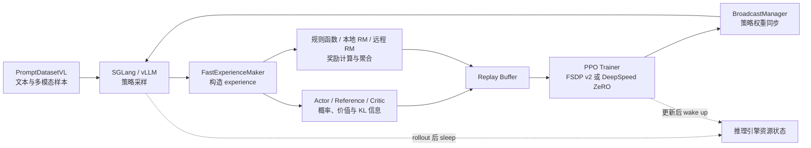

# LightRFT：面向多模态强化学习微调的轻量化训推闭环与奖励模型实践

## 摘要

大模型强化学习微调需要同时处理策略采样、奖励计算、优势估计、分布式优化和参数同步。对于多模态任务，图像、视频或音频输入又会引入额外的数据处理、模型前向与显存管理问题。LightRFT 尝试以较少的外部调度组件组织这一闭环：它使用 `torchrun` 和 PyTorch 分布式通信启动单程序多数据（SPMD）训练，在同一组 GPU 资源上交替执行 SGLang 或 vLLM 采样，以及 FSDP v2 或 DeepSpeed ZeRO 训练，并在每次策略更新后向推理引擎同步权重。

除策略优化外，LightRFT 将奖励建模作为独立的一等能力：框架能够组合规则函数、本地模型、远程服务和自定义奖励，并提供视觉与音频奖励模型训练入口。仓库中的任务示例覆盖文本、图像、视频和音频，但不同模态仍具有各自的模型与数据适配路径。因此，LightRFT 更准确的定位是一个以统一训推闭环和奖励模型工作流为中心的多模态强化学习微调研究框架，而不是对任意模型、任意模态和任意算法的无条件兼容层。

本文基于 LightRFT `0.1.1` 版本的 README、核心源码、配置类、训练入口和示例脚本，对其设计、实现边界、使用方法和已有实验记录进行说明。所有能力陈述均限定于本文检查到的代码路径；文中不据此推导未报告的吞吐、显存或收敛优势。

**关键词**：强化学习微调；RLVR；GRPO；PPO；多模态模型；奖励模型；FSDP；DeepSpeed；SGLang；vLLM

## 一、问题背景：大模型强化学习为何需要一个完整系统

监督微调的主要数据流通常是“样本—前向—损失—反向”。在线强化学习微调则形成一个动态闭环：当前策略先生成响应，奖励函数或奖励模型对响应评分，训练器依据采样时策略和当前策略的概率比、优势及 KL 约束更新模型，更新后的参数再用于下一轮采样。训练数据分布因此随着策略变化而变化。

这一过程至少涉及四类具有不同资源特征的计算：

1. **生成采样**：需要高吞吐自回归推理、KV cache 和可选 tensor parallel。
2. **奖励计算**：可能是低成本规则，也可能是一个或多个与策略模型规模相近的神经网络，或者远程服务。
3. **策略与价值网络训练**：需要保存激活、梯度和优化器状态，并依赖数据并行或参数分片。
4. **参数同步**：训练后的权重必须及时更新至推理引擎，否则采样策略和优化目标会发生额外偏离。

若分别为这些阶段长期保留独立 GPU，系统实现较直接，但资源成本较高；若让不同阶段共享设备，则需要处理缓存释放、模型状态切换、同步协议和异常恢复。多模态输入还会改变 tokenizer/processor、batch 结构与生成接口。LightRFT 的主要工程问题正是：如何在一个相对直接的 PyTorch 分布式程序中，组织上述组件并保持奖励与模态扩展能力。

## 二、项目定位与设计原则

LightRFT 的英文全称是 *Light, Efficient, Omni-modal & Reward-model Driven Reinforcement Fine-Tuning Framework*。从当前实现看，其设计可以概括为四点。

### 2.1 以 PyTorch 分布式进程作为统一运行骨架

主训练示例通过 `torchrun` 启动。`get_strategy` 根据 `--fsdp` 选择 FSDP v2，否则采用 DeepSpeed；两种后端共享 `StrategyBase` 所定义的模型准备、采样、引擎状态管理和权重更新接口。该设计没有引入 Ray 作为必需调度层，运行拓扑主要由 world size、数据并行组和推理引擎 tensor parallel 组构成。

这里的“轻量”主要指控制面和进程组织方式，不应理解为模型计算量或显存消耗天然较小。实际资源需求仍由模型参数量、序列长度、每个 prompt 的采样数、训练 batch、优化器状态及奖励模型共同决定。

### 2.2 在相同设备上分阶段复用训练与推理资源

项目将这一思路称为 **Colocate Anything**。推理引擎完成 rollout 后可以进入 sleep 状态，释放 KV cache、CUDA graph 等缓存；策略训练完成后，框架唤醒引擎、广播新权重并继续采样。该方法用阶段切换换取设备复用，也会引入休眠、唤醒和权重同步开销，是否有利取决于具体工作负载。

需要准确区分“共置”与“并行”：当前快速经验路径会先把多个本地 PyTorch 奖励模型迁入 GPU，再按配置顺序计算并逐个卸载，并不是在同一 GPU 上并行运行多个奖励模型。因此，该实现缩短了已完成模型的驻留时间，但峰值显存仍可能包含多个奖励模型。

### 2.3 将奖励计算与奖励模型训练纳入同一项目

LightRFT 不只消费一个预先给定的 reward scalar。代码允许奖励来自规则函数、本地模型、远程接口或自定义函数，并由 reward recipe 聚合；仓库还包含视觉序列奖励模型（SRM）、视觉生成奖励模型（GRM）及音频 SRM 的训练器和示例。这使“构建奖励—验证奖励—用于策略优化”能够在同一代码库中完成。

### 2.4 通过专用模型和数据路径扩展模态

核心模型目录包含文本 `ActorLanguage`、视觉语言 `ActorVL` 和音频语言 `ActorAL`。通用经验生成路径能够携带图像与视频字段，音频示例则在专用入口中适配 Qwen2-Audio 的 processor 和前向参数。由此可见，“全模态”在当前版本中是多个已实现模态路径的集合，而非单一抽象已经消除所有模态差异。

## 三、系统架构与一次训练迭代

### 3.1 组件关系



图中的 Reference 和 Critic 都是条件组件。Reference 主要在启用 KL 约束时提供参考 log-probability；Critic 只在 `--advantage_estimator gae` 的 PPO/GAE 路径中使用。其他优势估计器会清空 Critic 配置。

### 3.2 数据与经验生成

训练数据由 prompt、可选参考答案、奖励标签以及可选图像等媒体字段构成。以 GSM8K 预处理结果为例，每条样本包含格式化 prompt、数值参考答案和 `gsm8k_rule` 标签；Geo3K 则增加几何图像。推理引擎为每个 prompt 生成 `n_samples_per_prompt` 个响应后，`FastExperienceMaker` 组织以下信息：

- prompt 与 response token；
- action mask；
- 采样策略的旧 log-probability；
- 当前 Actor、Reference 和可选 Critic 的输出；
- 一项或多项奖励及其聚合值；
- 优势、回报、KL 和轨迹统计信息。

experience 随后进入 replay buffer。`train_batch_size` 可以小于、等于或大于 `rollout_batch_size`，分别形成较高频率更新、逐批更新或经验累积；源码强制的基本批量约束是：

$$
B_{\mathrm{train}} \bmod
\left(B_{\mathrm{micro}} \times N_{\mathrm{world}}\right)=0.
$$

对于 GRPO、RLOO、带组基线的 REINFORCE 和在线策略蒸馏，还要求每个 prompt 生成多于一个响应。

### 3.3 训练、同步与下一轮采样

训练器按 micro-batch 从 replay buffer 取出 experience，计算策略损失和可选 value loss。策略更新结束后，`StrategyBase.update_engine_weights` 通过 `BroadcastManager` 将 Actor 参数发送到推理引擎。若推理引擎此前处于休眠状态，框架先唤醒引擎再完成权重更新。

这种闭环避免了人工导出 checkpoint 再重新加载推理服务，但权重广播仍然是实际通信开销。引擎 tensor parallel size 必须能够整除分布式 world size；否则无法构造一致的 engine model-parallel 和 data-parallel 子组。

## 四、策略优化方法及其实现边界

LightRFT 的主入口 `examples/gsm8k_geo3k/train_colocate.py` 通过 `--advantage_estimator` 选择优势计算。当前从参数解析、优势计算工厂到训练器能够闭合运行的方法如下。

| 方法 | 参数值 | 关键计算 | Critic | 额外条件 |
| --- | --- | --- | --- | --- |
| PPO / GAE | `gae` | GAE 与裁剪策略/value loss | 是 | 未指定 Critic 路径时由 Actor 路径初始化 |
| REINFORCE | `reinforce` | 从序列奖励计算累计回报 | 否 | 无组采样要求 |
| RLOO | `rloo` | leave-one-out 组内基线 | 否 | 每个 prompt 多次采样 |
| REINFORCE with baseline | `reinforce_baseline` | 减去组均值，不除以组标准差 | 否 | 每个 prompt 多次采样 |
| GRPO | `group_norm` | 组内中心化并按标准差缩放 | 否 | 每个 prompt 多次采样 |
| CPGD | `cpgd` | CPGD 优势及可选非对称裁剪 | 否 | `--use_cpg_loss` 控制专用损失 |
| 在线策略蒸馏 | `on_policy_distillation` | 教师—学生 token 级 KL 信号，可叠加任务奖励 | 否 | 每个 prompt 多次采样并提供教师服务 |

### 4.1 GRPO 与组内相对优势

对于同一 prompt 的 $G$ 个响应及其奖励 $r_i$，当前 `GroupNormCalculator` 使用组均值和标准差构造标准化奖励：

$$
\hat r_i = \frac{r_i-\operatorname{mean}(r_1,\ldots,r_G)}
{\operatorname{std}(r_1,\ldots,r_G)+10^{-9}}.
$$

随后以累计回报构造 token 级优势，避免单独训练 Critic。命令行值应写为 `group_norm`；虽然内部工厂保留 `grpo` 别名，主入口的参数 choices 并不接受该别名。

`--dynamic_sampling` 会在组奖励全部为 0 或全部为 1 时将对应 action mask 置零，使没有组内区分度的样本不参与策略梯度。`--overlong_buffer` 则实现长度阈值与惩罚因子。这两项是受 DAPO 启发的机制，但当前代码不能据此视为完整复现 DAPO 的全部目标与裁剪设计。

### 4.2 PPO、CPGD 与 token 选择

默认策略损失采用 PPO 的概率比对称裁剪。启用 `--use_cpg_loss` 后，正优势和负优势分别使用上界或下界约束的非对称 log-probability 裁剪。`--high_entropy_token_ratio` 大于 0 时，框架依据 action entropy 为每个样本选择指定比例的高熵 token，只让这些位置进入策略损失；该参数为 0 时使用全部有效 action token。

奖励与优势还可以分别进行运行时归一化和裁剪：

- `--reward_running_norm` 与 `--reward_running_norm_minus_mean`；
- `--reward_clip`；
- `--advantages_norm`；
- `--advantage_clip`。

这些操作会直接改变优化目标的数值尺度，不宜在未记录消融实验的情况下同时开启全部选项。

### 4.3 FIRE 采样

`--use_fire` 使生成过程对第一个 token 使用 `--first_token_temperature`，其余 token 继续采用常规 `--temperature`。该机制旨在从生成起点增加多样性，但其作用取决于任务、模型与组采样规模；仓库没有提供可支持普遍性能结论的对照数据。

### 4.4 在线策略蒸馏

在线策略蒸馏先由学生模型生成 on-policy 响应，再请求教师服务返回相同响应上各 token 的 log-probability。实现中每个 token 的反向 KL 近似项为：

$$
d_t = \log \pi_{\mathrm{student}}(a_t\mid s_t)
      - \log \pi_{\mathrm{teacher}}(a_t\mid s_t),
$$

并在裁剪到 $[-20,20]$ 后构造 $-\beta d_t$ 形式的优势修正，$\beta$ 由 `--opd_kl_coef` 控制。保留任务奖励时，该项与 GRPO 任务优势相加；使用 `--no_task_reward` 时只保留蒸馏信号。

主入口的参数列表还保留 `reinforce++` 和 `--use_gspo` 等实验项，但当前优势计算工厂或实际策略损失没有形成相应的完整可运行链路。严谨起见，本文不把这些参数视为正式算法支持。

## 五、奖励系统：从可验证规则到学习型奖励

### 5.1 四类奖励来源

LightRFT 的奖励计算可分为四类：

1. **规则奖励**：直接比较最终答案、格式或任务约束，适合 GSM8K、Geo3K、音频选择题等可验证任务。
2. **本地奖励模型**：在训练进程可访问的设备上加载模型并评分；多个模型按序执行并及时卸载。
3. **远程奖励服务**：通过 URL 请求外部服务，便于将奖励模型与策略训练分离部署。
4. **自定义奖励函数与 recipe**：生成多个命名奖励分量，再按照任务逻辑加权或组合。

这四类信号最终都需要映射为与样本对应的标量奖励或 token 级信息。组合奖励时必须记录各分量的量纲、范围和权重；否则某个尺度更大的分量可能在没有明确设计依据的情况下支配优化。

### 5.2 规则奖励示例

GSM8K/Geo3K 示例采用答案正确性和格式约束：

$$
r = 0.9\,r_{\mathrm{accuracy}} + 0.1\,r_{\mathrm{format}}.
$$

这类奖励不需要额外神经网络，易于解释和复现，但只能度量被规则显式编码的属性。对于过程质量、开放式回答或感知质量，仅靠最终答案通常不足。

### 5.3 SRM、GRM 与通用 outcome reward model

仓库提供三类奖励模型相关路径：

- 视觉 SRM：对候选输出或偏好关系进行序列级评分；
- 视觉 GRM：为图像/视频生成相关任务提供学习型奖励；
- 音频 SRM：对文本—音频结果进行偏好或质量建模。

`examples/orm_rl_demo/` 进一步展示了如何在 Geo3K 中组合格式奖励、规则准确率和通用 outcome reward model（ORM）。它体现的不是某一单独算法，而是“多源奖励定义—逐项记录—加权聚合—GRPO 更新”的工作流。

## 六、多模态支持的实际组织方式

### 6.1 文本与图像

GSM8K 使用 `ActorLanguage` 和纯文本数据路径；Geo3K 使用 `ActorVL`、图像字段与模型 processor。`PromptDatasetVL` 和经验生成器负责将文本、图像及模型模板转换为推理后端和训练前向所需结构。

### 6.2 视频

版本 `0.1.1` 增加了强化学习微调中的视频数据与元数据兼容处理。仓库中的 `examples/grm_vl_rl/` 演示视频奖励模型参与策略优化。是否支持某个具体视频语言模型，仍取决于 Transformers processor、推理后端和模型前向接口是否兼容。

### 6.3 音频

`examples/r1_aqa/` 将 Qwen2-Audio 的 AVQA 任务接入 GRPO。其 `ActorAL` 使用音频模型所需的参数接口，示例还通过专用数据代码把音频特征和 attention mask 映射到框架可传递的数据槽。该实现证明了音频路径可以工作，但也表明当前音频支持包含任务级适配，并非完全复用视觉数据路径而无需修改。

## 七、分布式训练与资源管理

### 7.1 FSDP v2 与 DeepSpeed ZeRO

启动参数包含 `--fsdp` 时，框架选择 FSDP v2；否则选择 DeepSpeed。两种策略都负责模型构建、优化器与 scheduler 准备、梯度累积、模型保存和权重同步相关操作。DeepSpeed 可通过 `--zero_stage` 选择 ZeRO stage，并支持 `--adam_offload`；FSDP 路径包含 CPU offload、meta device 初始化和视觉模块分片选项。

这两种后端的 checkpoint 格式和恢复过程不同。若需要导出 Hugging Face 格式，应使用 `--save_hf_ckpt` 或仓库 `lightrft/utils/ckpt_scripts/` 中与所用后端匹配的转换脚本。

### 7.2 推理后端

SGLang 是源代码安装的默认后端，vLLM 通过可选依赖安装。两者都由统一策略接口创建引擎并参与权重广播，但底层内存管理和生成接口不同。切换后端时至少需要检查：

- 当前模型架构是否被该版本后端支持；
- tensor parallel size 与 world size 是否匹配；
- 多模态 processor 和媒体输入协议是否兼容；
- sleep/wake 功能是否在相应版本中正常工作；
- PyTorch、CUDA、FlashAttention 与后端二进制版本是否一致。

### 7.3 显存相关机制

LightRFT 提供的显存控制手段包括引擎 sleep/wake、梯度检查点、Adam offload、FSDP CPU offload、LoRA、视觉前缀冻结和 micro-batch 调节。它们作用于不同内存来源，不能相互等价替代。例如，降低 `engine_mem_util` 主要约束推理引擎，而优化器卸载主要减少训练状态的 GPU 占用。

## 八、安装与可复现的快速上手

### 8.1 源码环境

项目元数据要求 Python 3.12 及以上、PyTorch 2.9.1 及以上，并默认安装 SGLang 0.5.6.post2 及以上、DeepSpeed 0.18.3 及以上和 FlashAttention 2.8.3 及以上：

```bash
git clone https://github.com/opendilab/LightRFT.git
cd LightRFT
pip install -e .
```

如需 vLLM：

```bash
pip install -e ".[vllm]"
```

仓库还提供 Docker 参考环境：

```bash
docker pull opendilab/lightrft:v0.1.0
docker run --gpus all -it --rm \
  --ipc=host \
  -v /path/to/data:/app/data \
  -v /path/to/checkpoints:/app/checkpoints \
  opendilab/lightrft:v0.1.0 /bin/bash
```

当前 `Dockerfile` 固定使用 CUDA 12.8 对应的 PyTorch 2.9.0 wheel，并安装 DeepSpeed 0.18.3、vLLM 0.18.1、FlashAttention 2.8.3 和 SGLang 0.5.6.post2。它是特定依赖组合的参考，而不是所有驱动环境下都可互换的通用镜像。源码元数据与 Dockerfile 对 PyTorch 的声明不同，复现实验时应明确记录采用哪条安装路径。

### 8.2 GSM8K：规则奖励 GRPO

第一步，生成 LightRFT 使用的 Parquet 数据：

```bash
python examples/gsm8k_geo3k/data_preprocess/gsm8k.py \
  --local_save_dir /path/to/data/gsm8k
```

第二步，编辑 `examples/gsm8k_geo3k/run_grpo_gsm8k_qwen2.5_0.5b.sh`：

```bash
PATH_TO_YOUR_BASE_MODEL="Qwen/Qwen2.5-0.5B-Instruct"
PATH_TO_YOUR_GSM8K_DATASET="/path/to/data/gsm8k"

export NNODES=1
export GPUS_PER_NODE=8
ENGINE_TP=2
```

第三步，以 SGLang 启动：

```bash
ENGINE_TYPE=sglang \
  bash examples/gsm8k_geo3k/run_grpo_gsm8k_qwen2.5_0.5b.sh
```

或在安装 vLLM 后切换引擎：

```bash
ENGINE_TYPE=vllm \
  bash examples/gsm8k_geo3k/run_grpo_gsm8k_qwen2.5_0.5b.sh
```

该 shell 文件是八卡示例模板，不是与任意集群拓扑无关的“一键脚本”。运行前还应检查 W&B key、master 地址和端口、batch size、序列长度、模型可访问性以及 `ENGINE_TP`。单纯将 `GPUS_PER_NODE` 改为 1 而不修改其他并行和 batch 配置，通常不足以形成有效的单卡配置。

### 8.3 Geo3K：图像输入 GRPO

```bash
python examples/gsm8k_geo3k/data_preprocess/geo3k.py \
  --local_save_dir /path/to/data/geo3k

# 修改脚本中的模型和数据路径后运行
ENGINE_TYPE=sglang \
  bash examples/gsm8k_geo3k/run_grpo_geo3k_qwen2.5_vl_7b.sh
```

Geo3K 还提供 PPO 和 LoRA 版本：

```bash
bash examples/gsm8k_geo3k/run_ppo_geo3k_qwen2.5_vl_7b.sh
bash examples/gsm8k_geo3k/run_grpo_geo3k_lora_qwen2.5_vl_7b.sh
```

两者同样需要先修改用户配置区。

## 九、进阶用法

### 9.1 在线策略蒸馏

一体化脚本能够启动教师服务器、检查健康状态、运行学生训练并在退出时清理教师进程：

```bash
TEACHER_MODEL_PATH=/path/to/teacher \
STUDENT_MODEL_PATH=/path/to/student \
DATASET_PATH=/path/to/data.jsonl \
bash examples/on_policy_distillation/run_opd_qwen.sh
```

加入任务奖励：

```bash
USE_TASK_REWARD=true \
OPD_KL_COEF=1.0 \
bash examples/on_policy_distillation/run_opd_qwen.sh
```

也可分别运行 `start_teacher.sh` 和 `start_training.sh`，将教师部署到独立设备或节点。教师 URL 应指向能返回逐 token log-probability 的服务接口，而不是普通文本生成 API。

### 9.2 多奖励融合

ORM 示例通过环境变量提供策略、数据和奖励模型路径：

```bash
export DATA_PATH=/path/to/geo3k
export PRETRAIN_PATH=/path/to/Qwen2.5-VL-7B-Instruct
export REWARD_PRETRAIN_PATHS='{"general":"/path/to/general-reward-model"}'
bash examples/orm_rl_demo/run_general_fsdp_qwenvl.sh
```

在设计新的 reward recipe 时，建议分别记录每个奖励分量的原始均值、加权后贡献、方差及命中率，而不只记录最终总奖励。这样才能判断策略是在提升任务能力，还是主要适应格式或某个奖励模型的偏好。

### 9.3 轨迹保存与高熵 token 可视化

```bash
--save_trajectories \
--num_trajectories_to_save 10 \
--trajectory_analysis \
--mark_high_entropy_tokens \
--high_entropy_token_ratio 0.2
```

前四个参数中的轨迹开关用于保存和分析；`--high_entropy_token_ratio` 才会改变训练 loss 使用的 token 集合。生成的结构化轨迹可以使用 `examples/entropy_viz/render_trajectories.html` 在本地查看。

### 9.4 训练与评测

项目通过 `--eval_steps` 在训练期间运行评测，并通过 `--save_steps` 定期保存检查点。`examples/math_benchmarks/` 提供 Math500、AIME 2024/2025 和 GPQA Diamond 等入口。评测脚本通常需要单独配置模型路径、数据位置与生成参数；不同实验之间比较时应保持 prompt 模板、采样温度、最大生成长度和答案抽取逻辑一致。

## 十、已有实验记录：Geo3K ORM 强化学习示例

仓库提供了一次真实的双 GPU 全量训练记录。该实验用于验证多奖励模型工作流和端到端训练链路，不是多随机种子研究，也不是与其他框架的受控性能基准。

| 项目 | 配置 |
| --- | --- |
| Actor | Qwen2.5-VL-7B-Instruct |
| General RM | Qwen2.5-VL-7B general reward model |
| 数据集 | Geo3K |
| 训练与推理 | FSDP；SGLang；`rm_use_engine=True` |
| 奖励 | `0.1 × format + 0.2 × general_model + 0.7 × accuracy` |
| Batch | `train_batch_size=128`；`rollout_batch_size=128` |
| 采样 | `n_samples_per_prompt=8`；`num_episodes=20` |
| 长度 | `prompt_max_len=1024`；`generate_max_len=2048` |
| 优化 | 学习率 `1e-6`；初始 KL 系数 `0.001`；warmup ratio `0.03` |

完整运行达到 `train/global_step=320`，包含 16 次评测。仓库记录的结果为：

- `eval/reward_mean` 从 `0.4636` 变化到 `0.5679`；
- 最高 `eval/reward_mean=0.5686`，出现在 step 260；
- 最终 `eval/accuracy_reward_mean=0.5166`；
- 最终 `eval/format_reward_mean=0.9956`；
- 最终 `eval/general_model_reward_mean=0.1067`。


原始记录见 [ORM RL Demo](examples/orm_rl_demo/README_zh.md) 和 [W&B Run](https://wandb.ai/hansbug/ORM-RL-Demo-QwenVL-7B-Geo3K/runs/zrekazyw)。由于这里只报告一次运行，奖励上升不能单独证明统计显著性、跨模型泛化或相对其他训练框架的效率优势。它能够支持的结论是：给定上述配置，多源奖励、GRPO 更新、双 GPU FSDP 与 SGLang 推理链路完成了 320 个训练 step，并留下了可检查的逐分量指标和轨迹案例。

## 十一、与 OpenRLHF、slime 的架构比较

以下比较依据 2026 年 8 月 14 日检查到的各项目公开仓库与官方文档，讨论的是主要架构取向，而不是功能穷举。三个项目都在持续演进，且没有在相同硬件、模型、数据和超参数下发布可直接归因于框架的统一基准，因此不进行速度或显存排名。

| 维度 | LightRFT 0.1.1 | OpenRLHF | slime |
| --- | --- | --- | --- |
| 主要进程组织 | `torchrun` + PyTorch distributed 的 SPMD 闭环 | 以 Ray 组织训练、推理和奖励等角色 | 面向大规模 RL 的训练与数据生成系统 |
| 训练后端 | Hugging Face 模型 + FSDP v2 或 DeepSpeed ZeRO | Hugging Face 模型 + DeepSpeed | Megatron-LM |
| rollout 后端 | SGLang（默认）或 vLLM | 官方架构主要围绕 vLLM | SGLang 原生集成 |
| 训推资源关系 | 同组 GPU 分阶段共置，sleep/wake 后同步权重 | 支持多种 Ray 资源放置与混合部署方式 | 支持训练/rollout 分离部署或 `--colocate` 共置，并将 Megatron 参数同步至 SGLang |
| 奖励与模态侧重点 | 规则/本地/远程奖励聚合，含视觉与音频奖励模型训练；文本、图像、视频、音频示例 | 通用 LLM 对齐训练、可扩展 RLHF/RLVR 与 agent 工作流 | 大规模 RL 训练、SGLang 数据生成和自定义 rollout 流程 |

LightRFT 明确基于 [OpenRLHF](https://github.com/OpenRLHF/OpenRLHF) 开发，并改编或复用了部分实现。因此两者不宜被描述为完全独立的技术路线。LightRFT 在此基础上选择更直接的 `torchrun`/SPMD 组织，并把多模态奖励模型训练与示例放在项目的显著位置。

[slime](https://github.com/THUDM/slime) 的训练后端以 Megatron-LM 为核心，rollout 与数据生成侧紧密结合 SGLang，更强调大规模训练以及灵活的生成流程。与之相比，LightRFT 使用 Hugging Face 模型接口，并允许 FSDP 和 DeepSpeed 两种训练策略；这种差异主要影响模型接入方式、并行体系和运维复杂度，不能在没有控制实验时直接转化为效率高低结论。

选择框架时可以依次考虑：现有模型是否已有对应后端支持、集群是否已经部署 Ray 或 Megatron、是否需要训练奖励模型、rollout 是否包含复杂 agent/environment 交互，以及团队对 checkpoint 与并行策略的维护经验。框架名称或单一特性不应替代这些约束分析。

## 十二、当前限制与使用边界

从研究复现和工程采用角度，LightRFT 当前有以下需要显式记录的边界：

1. **算法声明应以可运行链路为准。** 参数解析器中的实验 flags 不一定已经连接到实际 loss 或优势工厂；本文已将其与正式支持分开。
2. **没有跨框架统一性能基准。** 仓库提供训练曲线和任务示例，但不足以支持“快于某框架”或“节省固定比例显存”的结论。
3. **多模态兼容依赖具体模型。** 文本、视觉、视频和音频均有代码或示例，不代表任意 Hugging Face 多模态模型都能直接运行。
4. **多个本地奖励模型先统一 reload，再顺序执行。** 已完成计算的模型会逐个 offload，但初始峰值显存仍可能同时包含全部本地奖励模型；总奖励计算延迟也会随模型数量增加。
5. **示例脚本包含环境假设。** GPU 数、路径、端口、W&B 配置与模型名称需要逐项检查，不能直接视为通用默认值。
6. **依赖组合较敏感。** PyTorch、CUDA、FlashAttention、vLLM 和 SGLang 都包含编译或二进制兼容关系；Docker 与源码安装的版本声明也不完全相同。
7. **共置存在阶段切换成本。** sleep/wake 和权重同步能够复用设备，但短 rollout 或小模型下的相对收益需要实测。

这些限制并不否定项目的用途。相反，明确边界有助于把 LightRFT 用在其当前最合适的场景：希望以 Hugging Face 模型、FSDP/DeepSpeed 和 SGLang/vLLM 构建在线强化学习闭环，同时需要规则奖励、学习型奖励或多模态奖励实验的团队。

## 十三、代码结构与进一步阅读

```text
LightRFT/
├── lightrft/
│   ├── datasets/                 # 文本与多模态数据处理
│   ├── evaluation/               # 评测和任务奖励
│   ├── models/                   # Actor、Critic、SRM、GRM 与损失
│   ├── strategy/                 # FSDP、DeepSpeed、推理引擎和权重同步
│   ├── trainer/                  # experience、优势计算、replay buffer 和训练器
│   └── utils/                    # 日志、轨迹和 checkpoint 工具
├── examples/                     # 训练、蒸馏、奖励模型和评测示例
├── docs/                         # Sphinx 文档
├── tools/                        # 版本与 Docker 辅助工具
├── README.md
└── README_zh.md
```

推荐阅读顺序：

1. [中文 README](README_zh.md)：安装、配置和功能边界。
2. [GSM8K/Geo3K 教程](docs/source/quick_start/grpo_gsm8k_geo3k_tutorial_zh.md)：基础训练流程。
3. [训练策略说明](docs/source/best_practice/strategy_zh.md)：FSDP、DeepSpeed 与推理引擎配置。
4. [奖励模型文档](docs/source/best_practice/reward_model_zh.md)：SRM/GRM 数据与训练实践。
5. [在线策略蒸馏示例](examples/on_policy_distillation/README_zh.md)：教师服务和学生训练。
6. [ORM RL Demo](examples/orm_rl_demo/README_zh.md)：多奖励融合与一次完整运行记录。
7. [数学评测说明](examples/math_benchmarks/README.md)：Math500、AIME 和 GPQA 评测。

项目相关链接：

- LightRFT 仓库：<https://github.com/opendilab/LightRFT>
- Issue：<https://github.com/opendilab/LightRFT/issues>
- v0.1.2 路线图：<https://github.com/opendilab/LightRFT/issues/28>
- OpenRLHF：<https://github.com/OpenRLHF/OpenRLHF>
- slime：<https://github.com/THUDM/slime>
- 联系邮箱：opendilab@pjlab.org.cn

算法背景资料：

- PPO：<https://arxiv.org/abs/1707.06347>
- GRPO：<https://arxiv.org/abs/2402.03300>
- FIRE：<https://arxiv.org/abs/2410.21236>
- CPGD：<https://arxiv.org/abs/2505.12504>
- 高熵 token 选择：<https://arxiv.org/abs/2506.01939>
- On-Policy Distillation：<https://thinkingmachines.ai/blog/on-policy-distillation/>

## 十四、总结

LightRFT 的核心价值不在于简单增加算法名称，而在于把策略采样、奖励计算、优势估计、分布式训练和推理权重更新组织为可检查的闭环，并把奖励模型训练及多模态任务示例纳入同一仓库。`torchrun`/SPMD、FSDP/DeepSpeed 双训练后端、SGLang/vLLM 双 rollout 后端和引擎 sleep/wake 构成其系统主线；规则奖励、SRM/GRM、通用 ORM 与在线策略蒸馏构成其奖励主线。

对于初次使用者，最稳妥的路径是先复现 GSM8K 规则奖励示例，确认分布式拓扑、引擎状态切换和 checkpoint 流程，再进入 Geo3K 或奖励模型融合任务。对于研究报告，应同时记录代码版本、安装路径、模型与数据版本、完整 reward recipe、每个奖励分量、生成配置和随机种子，并避免把单次运行曲线解释为普遍性能结论。

## 引用与许可证

如在研究或应用中使用 LightRFT，请引用：

```bibtex
@misc{lightrft,
  title={LightRFT: Light, Efficient, Omni-modal & Reward-model Driven Reinforcement Fine-Tuning Framework},
  author={Niu, Yazhe and Pu, Yuan and Shi, Dongxing and Lu, Yudong and Xiong, Yingtong and Ge, Ruijun and Sun, Jiaxuan and Wan, Zunian and Zhang, Shaoang},
  publisher={GitHub},
  howpublished={\url{https://github.com/opendilab/LightRFT}},
  year={2025},
}
```

项目采用 [Apache License 2.0](LICENSE)。LightRFT 基于 OpenRLHF 开发，部分文件与实现由 OpenRLHF 改编或复用，并使用或借鉴了 verl、SGLang、vLLM、DeepSpeed 与 PyTorch FSDP 等开源项目。
