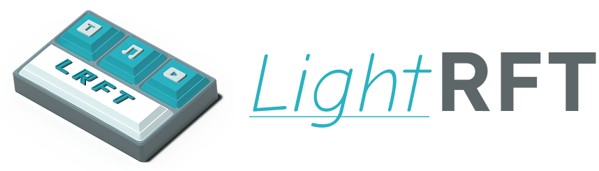

.. LightRFT documentation main file

欢迎来到 LightRFT 文档!
=====================================

**LightRFT** (Light Reinforcement Fine-Tuning) 是一个专为大语言模型 (LLM)、视觉语言模型 (VLM) 的强化微调任务设计的轻量、高效且通用的强化学习微调框架。其核心优势包括：

* **全面的 RLVR + RLHF 与多模态训练支持**：原生支持 RLVR 与 RLHF 训练，覆盖文本/图像/视频/音频等多种模态，并支持从基础模型到奖励模型及奖励规则的全流程构建。
* **设计统一的 Strategy 抽象层**：通过高度抽象的 Strategy 层灵活控制训练（DeepSpeed/FSDPv2）和高性能推理（vLLM/SGLang）策略。
* **易用且高效的多模型共置范式**：支持灵活的多模型共置（Co-location）训练，助力在大规模场景下实现可扩展的算法探究与比较。

核心特性
------------

🚀 **高性能推理引擎**
   * 集成 vLLM 和 SGLang 以实现高效采样和推理
   * FP8 推理优化（Work in Progress），降低延迟和显存占用
   * 灵活的引擎休眠/唤醒机制，实现最佳资源利用

🧠 **丰富的算法生态**
   * 策略优化 (Policy Optimization): GRPO, GSPO, GMPO, Dr.GRPO
   * 优势估计 (Advantage Estimation): REINFORCE++, CPGD
   * 奖励处理 (Reward Processing): Reward Norm/Clip
   * 采样策略 (Sampling Strategy): FIRE Sampling, Token-Level Policy
   * 稳定性增强 (Stability Enhancement): Clip Higher, select_high_entropy_tokens

🔧 **灵活的训练策略**
   * 支持 FSDP (Fully Sharded Data Parallel)
   * 支持 DeepSpeed ZeRO (Stage 1/2/3)
   * 梯度检查点 (Gradient checkpointing) 和混合精度训练 (BF16/FP16)
   * Adam Offload 和显存优化技术

🌐 **全面的多模态支持**
   * 原生视觉-语言模型 (VLM) 训练
   * 支持 Qwen-VL, LLaVA 等主流 VLM
   * 支持多个奖励模型的多模态奖励建模

📊 **完整的实验工具链**
   * Weights & Biases (W&B) 集成
   * 数学能力基准测试 (GSM8K, Geo3K 等)
   * 轨迹保存和分析工具
   * 自动检查点管理

文档内容
----------------------

.. toctree::
   :maxdepth: 2
   :caption: 快速入门

   installation/index_zh
   quick_start/index_zh

.. toctree::
   :maxdepth: 2
   :caption: 用户指南与最佳实践

   best_practice/index_zh

.. toctree::
   :maxdepth: 1
   :caption: API 文档

   api_doc/utils/index
   api_doc/datasets/index
   api_doc/models/index
   api_doc/strategy/index
   api_doc/trainer/index

快速链接
-----------

* :ref:`installation_zh` - 安装指南
* :doc:`quick_start/algorithms_zh` - 支持的算法
* :doc:`best_practice/strategy_zh` - 策略使用指南
* :doc:`quick_start/configuration_zh` - 配置参数
* :doc:`best_practice/faq_zh` - 常见问题解答
* :doc:`best_practice/troubleshooting_zh` - 故障排除指南

索引与表格
==================

* :ref:`genindex`
* :ref:`modindex`
* :ref:`search`
