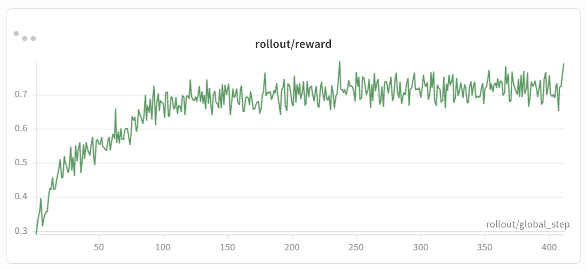
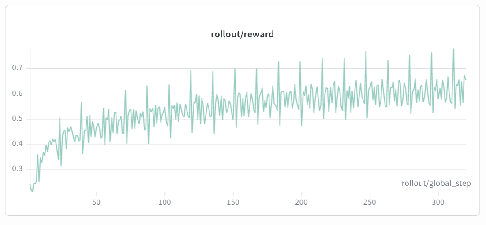
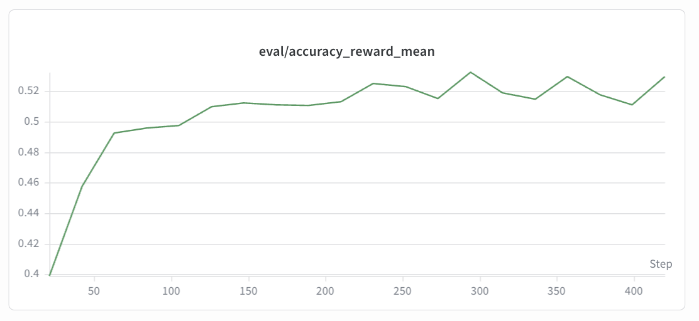
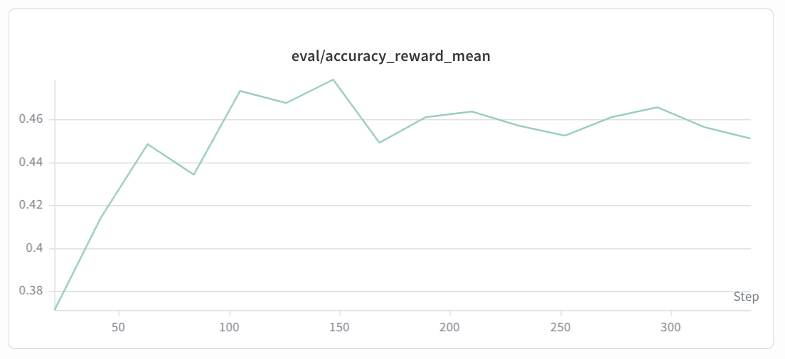

# GRPO 训练教程：GSM8K 与 Geo3K 数据集

本教程介绍如何使用 LightRFT 在两个数学推理数据集上进行 GRPO（Group Relative Policy Optimization）训练：**GSM8K**（纯文本）和 **Geo3K**（多模态，含几何图形）。

## 概述

| 项目 | GSM8K | Geo3K |
|------|-------|-------|
| 任务 | 小学数学应用题 | 几何问题求解 |
| 模态 | 纯文本 | 多模态（文本 + 图像） |
| 数据来源 | [openai/gsm8k](https://huggingface.co/datasets/openai/gsm8k) | [hiyouga/geometry3k](https://huggingface.co/datasets/hiyouga/geometry3k) |
| 训练集 / 测试集 | 7,473 / 1,319 | ~2,100 / 601 |
| 奖励机制 | 纯规则奖励（无需神经奖励模型） | 纯规则奖励（无需神经奖励模型） |
| 基座模型 | Qwen2.5-0.5B-Instruct（或更大模型） | Qwen2.5-VL-7B-Instruct |

两个任务均使用**纯规则奖励**机制：
- **格式奖励（10%）**：检查输出是否包含 `<think>...</think>` 推理标签和 `\boxed{}` 答案标记。
- **准确率奖励（90%）**：使用 [mathruler](https://github.com/open-compass/mathruler) 验证最终答案的正确性。

无需额外的神经奖励模型。

---

## 1. 数据集预处理

训练前，需要将 HuggingFace 原始数据集转换为 LightRFT 兼容的 parquet 格式。

### 1.1 GSM8K 预处理

```bash
python examples/gsm8k_geo3k/data_preprocess/gsm8k.py \
    --local_save_dir ~/data/gsm8k
```

脚本执行以下步骤：

1. 从 HuggingFace 加载 `openai/gsm8k`（也可通过 `--local_dataset_path` 指定本地路径）。
2. 从每个解答中通过 `#### ANSWER` 模式提取数值答案（去除逗号，如 `1,000` → `1000`）。
3. 将每个问题封装为 chat 结构的 prompt：

```json
{
  "prompt": [
    {"role": "system", "content": "You FIRST think about the reasoning process step by step ... The final answer MUST BE put in \\boxed{} after the reasoning."},
    {"role": "user", "content": "<原始问题>"}
  ],
  "extra_info": {
    "label": "gsm8k_rule",
    "reference": "<提取的数值答案>"
  }
}
```

4. 将 `train.parquet` 和 `test.parquet` 保存到指定目录。

### 1.2 Geo3K 预处理

```bash
python examples/gsm8k_geo3k/data_preprocess/geo3k.py \
    --local_save_dir ~/data/geo3k
```

脚本执行以下步骤：

1. 从 HuggingFace 加载 `hiyouga/geometry3k`（也可通过 `--local_dataset_path` 指定本地路径）。
2. 保留数据集中的几何图形图像。
3. 将每个问题封装为包含图像引用的 chat 结构 prompt：

```json
{
  "prompt": [
    {"role": "system", "content": "You FIRST think about the reasoning process ... The final answer MUST BE put in \\boxed{}."},
    {"role": "user", "content": "<几何问题文本>"}
  ],
  "images": ["<PIL Image>"],
  "extra_info": {
    "label": "geo3k_rule",
    "reference": "<标准答案>"
  }
}
```

4. 将 `train.parquet` 和 `test.parquet` 保存到指定目录。

### 1.3 输出格式总结

两个预处理脚本产出统一的数据格式：

| 字段 | 说明 |
|------|------|
| `prompt` | Chat 结构列表 `[{role, content}, ...]` |
| `images` | PIL 图像列表（仅 Geo3K；GSM8K 无此字段） |
| `extra_info.label` | `"gsm8k_rule"` 或 `"geo3k_rule"` — 映射到奖励 RECIPE |
| `extra_info.reference` | 标准答案字符串，用于规则奖励评估 |

---

## 2. 训练

### 2.1 GSM8K — 纯文本 GRPO 训练

```bash
# 先编辑脚本中的路径配置，然后执行：
bash examples/gsm8k_geo3k/run_grpo_gsm8k_qwen2.5_0.5b.sh
```

也可直接使用 `torchrun` 启动：

```bash
torchrun --nnodes 1 --nproc-per-node 8 \
    examples/gsm8k_geo3k/train_colocate.py \
    --pretrain Qwen/Qwen2.5-0.5B-Instruct \
    --prompt_data /path/to/gsm8k_dataset \
    --input_key prompt --label_key label \
    --text_only \
    --loss_agg_mode seq-mean-token-mean \
    --advantage_estimator group_norm \
    --n_samples_per_prompt 5 \
    --num_episodes 30 \
    --max_epochs 1 \
    --train_batch_size 128 \
    --rollout_batch_size 128 \
    --micro_train_batch_size 4 \
    --micro_rollout_batch_size 4 \
    --actor_learning_rate 1e-6 \
    --lr_warmup_ratio 0.03 \
    --init_kl_coef 0.01 \
    --kl_estimator k3 \
    --use_kl_loss \
    --l2 1.0e-2 \
    --fsdp --zero_stage 3 --bf16 \
    --flash_attn --gradient_checkpointing \
    --apply_chat_template \
    --freeze_prefix \
    --adam_offload \
    --rm_use_engine \
    --reward_pretrain "{}" \
    --engine_type sglang --engine_tp_size 2 \
    --engine_mem_util 0.6 --enable_engine_sleep \
    --eval_steps 20 --eval_split test \
    --max_eval_samples 1319 \
    --save_path results/gsm8k_grpo \
    --save_steps 20 --max_ckpt_num 3 \
    --system_prompt 'A conversation between the User and Assistant. The User asks a question, and the Assistant provides a solution. The Assistant first thinks through the reasoning process internally with self-reflection and consistency check and then gives the final analysis and answer. The reasoning process should be enclosed within <think></think>, followed directly by the final thought and answer, the final answer MUST BE put in \\boxed{}, like this: <think> reasoning process here </think> final thought and \\boxed{answer} here.'
```

### 2.2 Geo3K — 多模态 GRPO 训练

```bash
# 先编辑脚本中的路径配置，然后执行：
bash examples/gsm8k_geo3k/run_grpo_geo3k_qwen2.5_vl_7b.sh
```

也可直接使用 `torchrun` 启动：

```bash
torchrun --nnodes 1 --nproc-per-node 8 \
    examples/gsm8k_geo3k/train_colocate.py \
    --pretrain Qwen/Qwen2.5-VL-7B-Instruct \
    --prompt_data /path/to/geo3k_dataset \
    --input_key prompt --label_key label \
    --mixed_mm_data \
    --images_key images \
    --loss_agg_mode seq-mean-token-mean \
    --advantage_estimator group_norm \
    --n_samples_per_prompt 8 \
    --num_episodes 20 \
    --max_epochs 1 \
    --train_batch_size 128 \
    --rollout_batch_size 128 \
    --micro_train_batch_size 4 \
    --micro_rollout_batch_size 8 \
    --actor_learning_rate 1e-6 \
    --lr_warmup_ratio 0.03 \
    --init_kl_coef 0.01 \
    --kl_estimator k3 \
    --use_kl_loss \
    --l2 1.0e-2 \
    --fsdp --zero_stage 3 --bf16 \
    --flash_attn --gradient_checkpointing \
    --apply_chat_template \
    --freeze_prefix \
    --adam_offload \
    --rm_use_engine \
    --reward_pretrain "{}" \
    --engine_type sglang --engine_tp_size 2 \
    --engine_mem_util 0.6 --enable_engine_sleep \
    --limit_mm_image_per_prompt 10 \
    --eval_steps 20 --eval_split test \
    --max_eval_samples 700 \
    --save_path results/geo3k_grpo \
    --save_steps 20 --max_ckpt_num 2 \
    --system_prompt 'A conversation between the User and Assistant. The User asks a question, and the Assistant provides a solution. The Assistant first thinks through the reasoning process internally with self-reflection and consistency check and then gives the final analysis and answer. The reasoning process should be enclosed within <think></think>, followed directly by the final thought and answer, the final answer MUST BE put in \\boxed{}, like this: <think> reasoning process here </think> final thought and \\boxed{answer} here.'
```

### 2.3 Geo3K — LoRA GRPO 训练（参数高效微调）

在资源受限的环境下，可使用 LoRA 仅微调少量参数：

```bash
bash examples/gsm8k_geo3k/run_grpo_geo3k_lora_qwen2.5_vl_7b.sh
```

LoRA 相关的关键参数：

```bash
--lora_rank 128 \
--lora_alpha 256 \
--target_modules all-linear
```

---

## 3. 关键超参数

| 参数 | GSM8K 默认值 | Geo3K 默认值 | 说明 |
|------|:---:|:---:|------|
| `--n_samples_per_prompt` | 5 | 8 | 每个 prompt 的 rollout 采样数（GRPO 组大小） |
| `--num_episodes` | 30 | 20 | 总训练轮数 |
| `--train_batch_size` | 128 | 128 | 全局训练批次大小 |
| `--rollout_batch_size` | 128 | 128 | 全局 rollout 批次大小 |
| `--micro_train_batch_size` | 4 | 4 | 每张卡的微训练批次大小 |
| `--micro_rollout_batch_size` | 4 | 8 | 每张卡的微 rollout 批次大小 |
| `--actor_learning_rate` | 1e-6 | 1e-6 | Actor 学习率 |
| `--lr_warmup_ratio` | 0.03 | 0.03 | 学习率预热比例 |
| `--init_kl_coef` | 0.01 | 0.01 | KL 散度惩罚系数 |
| `--kl_estimator` | k3 | k3 | KL 估计器类型 |
| `--prompt_max_len` | 1024 | 1024 | 最大 prompt 长度 |
| `--generate_max_len` | 2048 | 2048 | 最大生成长度 |
| `--advantage_estimator` | group_norm | group_norm | GRPO 优势估计方法 |
| `--engine_tp_size` | 2 | 2 | 推理引擎张量并行度 |
| `--l2` | 1e-2 | 1e-2 | L2 正则化权重 |
| `--text_only` | 是 | 否 | 纯文本模式（不处理图像） |
| `--mixed_mm_data` | 否 | 是 | 启用多模态数据处理 |

---

## 4. 奖励机制

### 4.1 RECIPE 配置

奖励系统由 `examples/gsm8k_geo3k/reward_models_utils.py` 中基于标签的 RECIPE 映射驱动：

```python
RECIPE = {
    "geo3k_rule": [("geo3k_rule", None, 1.0)],
    "gsm8k_rule": [("gsm8k_rule", None, 1.0)],
}
```

每个样本的 `label` 字段（在预处理阶段设置）决定了应用哪个奖励函数。

### 4.2 格式奖励（权重 10%）

验证模型输出是否遵循要求的推理格式：

```
<think> 推理过程 </think> 最终分析和 \boxed{答案}
```

检查逻辑使用正则表达式验证：
1. 存在 `<think>...</think>` 标签。
2. 存在 `\boxed{...}` 标记。
3. `</think>` 闭合标签出现在 `\boxed{}` **之前**。

```python
def format_reward_fn(sol: str) -> float:
    think_match = re.search(r'<think>.*?</think>', sol, re.DOTALL)
    boxed_match = re.search(r'\\boxed\{.*?\}', sol, re.DOTALL)
    if think_match and boxed_match:
        return 1.0 if think_match.end() <= boxed_match.start() else 0.0
    return 0.0
```

### 4.3 准确率奖励（权重 90%）

从 `\boxed{}` 中提取答案并与标准答案比对：

```python
def accuracy_reward_fn(sol: str, gt: str) -> float:
    from mathruler.grader import extract_boxed_content, grade_answer
    pred = extract_boxed_content(sol)
    return 1.0 if grade_answer(pred, gt) else 0.0
```

`mathruler.grader` 处理数值等价、分数化简等数学归一化。

### 4.4 综合奖励

```python
final_reward = 0.9 * accuracy_reward + 0.1 * format_reward
```

### 4.5 响应提取

在计算奖励前，会从完整的对话文本中提取 assistant 的回复，避免系统提示中的示例导致误判：

```python
def extract_response(text: str) -> str:
    # 查找最后一个 <|im_start|>assistant ... <|im_end|> 片段
    ...
```

---

## 5. 训练监控（W&B）

### 5.1 启用 W&B 日志

在训练脚本中设置以下环境变量：

```bash
export WANDB_API_KEY="your_api_key"
export WANDB_PROJECT="LightRFT-Experiments"
export WANDB_MODE="online"  # "offline" 表示仅本地记录
```

### 5.2 关键指标

#### rollout/reward

**GSM8K (Qwen2.5-0.5B-Instruct)**:



**Geo3K (Qwen2.5-VL-7B-Instruct)**:



**预期走势**：`rollout/reward` 曲线应随训练步数呈现稳定上升趋势。在训练初期，奖励通常较低，因为模型尚未学会正确的格式和推理模式。随着训练推进，奖励应逐步平滑、单调递增，伴有轻微波动，并最终趋于稳定。若奖励过早停滞或急剧下降，建议调整 KL 系数或学习率。

#### eval/accuracy

**GSM8K (Qwen2.5-0.5B-Instruct)**:



**Geo3K (Qwen2.5-VL-7B-Instruct)**:



**预期走势**：`eval/accuracy` 曲线反映模型在测试集上的实际解题能力，应与奖励曲线正相关但可能略有滞后。准确率预计从基座模型的初始水平逐步提升，整体呈上升趋势并最终趋于收敛。由于评估样本量较小，eval 曲线的波动会比 reward 曲线更大。若出现突然下降，可能表明过拟合或 KL 散度问题，建议适当调整 KL 系数或学习率。

### 5.3 其他有用指标

| 指标 | 说明 |
|------|------|
| `rollout/format_reward` | 格式合规率 |
| `rollout/accuracy_reward` | 答案正确率 |
| `train/actor_loss` | Actor 策略损失（应逐步下降） |
| `train/kl_divergence` | 与参考策略的 KL 散度（应保持有界） |
| `train/entropy` | 策略熵（逐步下降表明模型在学习） |

---

## 6. 常见问题与建议

- **OOM（显存不足）**：减小 `micro_train_batch_size` / `micro_rollout_batch_size`，或降低 `--engine_mem_util`。
- **收敛缓慢**：增大 `--n_samples_per_prompt` 以获得更好的 GRPO 优势估计。
- **格式奖励始终为 0**：检查 `--system_prompt` 和 `--apply_chat_template` 是否正确传入。
- **Geo3K 图像加载错误**：确保预处理后的 parquet 文件包含有效的 PIL 图像对象，且设置了 `--images_key images`。
- **LoRA 训练**：使用 `--lora_rank 128 --lora_alpha 256` 在效率和模型容量之间取得良好平衡。

---

## 相关资源

- [支持的算法](algorithms_zh.md) — 完整算法文档
- [配置参数参考](configuration_zh.md) — 完整参数文档
- [训练策略指南](../best_practice/strategy_usage_zh.md) — FSDP、DeepSpeed 和推理引擎配置
