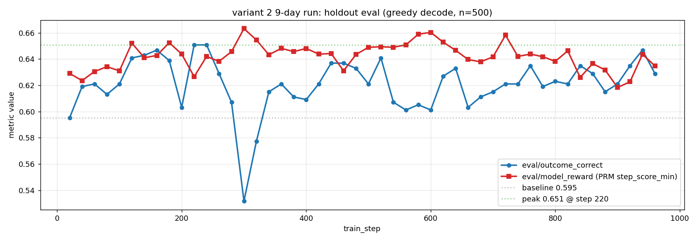
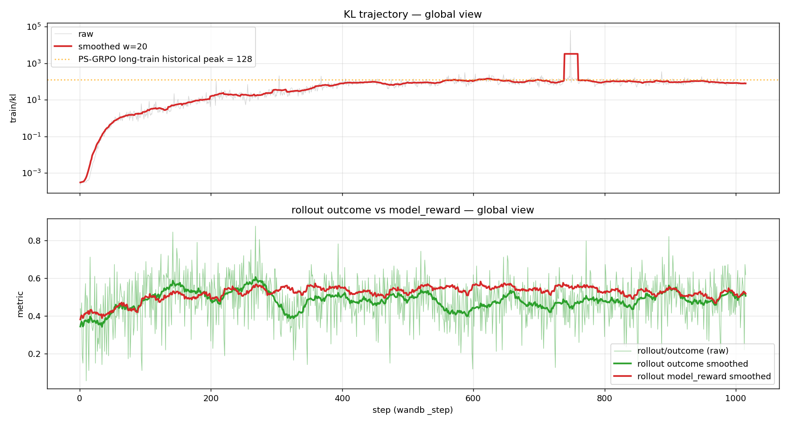
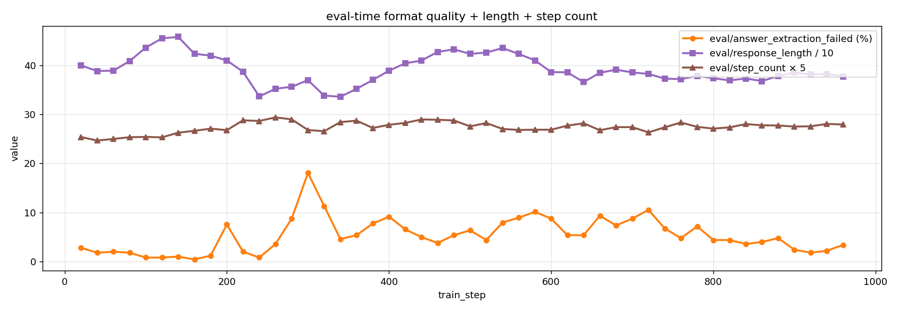
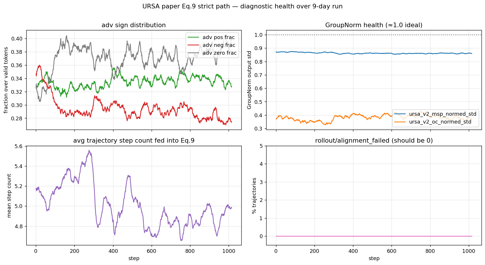

# Math PRM: GRPO Training with a Process Reward Model

This example trains [URSA-8B](https://huggingface.co/URSA-MATH/URSA-8B) — a multimodal math VLM — with [URSA-8B-RM](https://huggingface.co/URSA-MATH/URSA-RM-8B) as a Process Reward Model (PRM), using the GRPO algorithm with a **PS-GRPO** reward signal as proposed in the [URSA paper (NeurIPS 2025)](https://arxiv.org/abs/2501.04686).

Unlike the rule-based examples under `examples/gsm8k_geo3k/`, the reward here comes from a neural reward model that scores **each reasoning step**, and the final per-trajectory reward depends on *how the step scores evolve* across the response, not just on whether the final answer is right.

The example ships **two algorithm paths** side by side:

1. **PS-GRPO** (`run_grpo_math_prm_ursa_8b.sh`) — the paper's recommended reward `r ∈ {0, 0.5, 1}`, used as a single per-trajectory scalar by standard GRPO. This is the production recipe.
2. **Eq.9 ablation with step-level advantage** (`run_grpo_math_prm_ursa_8b_variant2.sh`) — the per-step PRM advantage `A_t^i = r_{s,t}^i · GroupNorm_G(r̄_s^i) + GroupNorm_G(r_o^i)` (paper Appendix B.1). The paper itself rejects this in favour of PS-GRPO; it ships here as an ablation comparator. The advantage estimator lives entirely in [`ursa_variant2.py`](ursa_variant2.py) (zero edits to `lightrft/`).

## Overview

| Item | Math PRM |
|------|----------|
| Task | Multimodal math reasoning (text + image questions) |
| Modality | Multi-modal (text + image) |
| Actor | URSA-8B (hybrid SAM-B + SigLIP-L vision tower + Qwen2.5-Math-Instruct) |
| Reward Model | URSA-8B-RM (process reward model, step-level scoring) |
| Reward formula (PS-GRPO) | `r ∈ {0, 0.5, 1}` (correctness × step-stability) |
| Algorithm | GRPO (group_norm advantage estimator) or `ursa_variant2` for paper Eq.9 |
| Rollout engine | Local Hugging Face (vLLM/SGLang URSA support is future work) |

The PS-GRPO reward is computed inside `MathPRMReward` ([reward_models.py](reward_models.py)) and follows the URSA paper:

```text
r =  0                          if outcome_correct == 0
r =  1                          if outcome_correct == 1 and no step-score drop
r =  0.5  ( = 1 - DROP_GAMMA)   if outcome_correct == 1 but a step-score drop occurred
```

A **step-score drop** is detected when any consecutive pair of step scores has a relative drop ≥ `_DROP_THRESHOLD = 0.3`.

---

## 1. Dataset Preprocessing

The training data is `MMathCoT-1M` (Stage 3 split), which needs to be converted into the LightRFT manifest schema. Both `--input-path` and `--image-root` are **required** (no defaults — paths are environment-specific):

```bash
python examples/math_prm/tools/prepare_ursa_stage3_manifest.py \
    --input-path  /your/data/URSA-MATH/MMathCoT-1M/train.jsonl \
    --image-root  /your/data/URSA-MATH/images \
    --output-path /your/output/math_psgrpo.jsonl
```

Each row in the converted manifest looks like:

```json
{
  "prompt": "Math question text",
  "images": ["/abs/path/to/image.png"],
  "reference": "Ground-truth answer",
  "label": "math_psgrpo"
}
```

The `label` field is what selects the reward path. Available labels:

| Label | Reward signal |
|---|---|
| `math_psgrpo` | PS-GRPO: `{0, 0.5, 1}` (default for this example) |
| `math_prm` | Pure PRM aggregated step score (continuous in `[0, 1]`) |
| `math_prm_combined` | PRM aggregated score + 0.5 × rule-based correctness |
| `math_rule` | Rule-only baseline `{0, 1}` based on answer match |
| `math_per_step_prm` | Per-step PRM scores for `--advantage_estimator ursa_variant2` (paper Eq.9, see §6) |

For a smoke conversion (32 samples), pass `--max-samples 32`.

---

## 2. Model Checkpoints

You need both the URSA-8B actor and the URSA-8B-RM reward model:

```bash
# Hugging Face IDs
URSA-MATH/URSA-8B       # actor
URSA-MATH/URSA-RM-8B    # reward model
```

Download to a local directory and set the paths in `run_grpo_math_prm_ursa_8b.sh`.

---

## 3. Configure and Run Training (PS-GRPO recipe)

Edit `Part 1: User Configuration` at the top of [run_grpo_math_prm_ursa_8b.sh](run_grpo_math_prm_ursa_8b.sh):

```bash
PATH_TO_YOUR_BASE_MODEL="/path/to/URSA-8B"
PATH_TO_URSA_RM="/path/to/URSA-RM-8B"
PATH_TO_YOUR_MATH_DATASET="/path/to/math_psgrpo.jsonl"
EXPERIMENT_NAME="lightrft-ursa8b-math-prm"
export WANDB_API_KEY="YOUR_WANDB_API_KEY"   # leave empty to disable W&B
```

Then run:

```bash
bash examples/math_prm/run_grpo_math_prm_ursa_8b.sh
```

The default machine target is `1 node × 8 A100/H100 GPUs`. For a different topology, override the standard env vars:

```bash
NNODES=2 GPUS_PER_NODE=8 NODE_RANK=0 \
MASTER_ADDR=10.0.0.1 MASTER_PORT=20092 \
bash examples/math_prm/run_grpo_math_prm_ursa_8b.sh
```

---

## 4. Key Hyperparameters

The launcher uses the URSA-MATH paper's Stage 3 defaults:

| Param | Value | Notes |
|---|---|---|
| `N_SAMPLES` | 8 | Responses sampled per prompt for GRPO |
| `EPISODE` | 10 | Total training episodes |
| `RBS` / `TBS` | 128 / 128 | Rollout / training batch size |
| `KL` | 0.001 | Initial KL coefficient |
| `KL_TARGET` | (off) | If set, switches to AdaptiveKLController |
| `LR` | 1e-6 | Actor learning rate |
| `PROMPT_MAX_LEN` | 1024 | |
| `GENERATE_MAX_LEN` | 3072 | |
| `MAX_SAMPLES` | 15360 | Cap on the training subset; approximates the paper's filtered ~15.3K Stage 3 scale, but this launcher does not run the paper data-filtering pipeline |
| `EVAL_HOLDOUT_SIZE` | 500 | A deterministic held-out subset is reserved from `prompt_data` for in-domain eval |

To enable the adaptive KL controller (recommended if you observe the KL drifting), set `KL_TARGET` to a small positive value, e.g. `KL_TARGET=0.5`.

---

## 5. What's Logged

W&B panels are split into three namespaces:

- `rollout/*` — per-step rollout statistics: `reward`, `outcome_correct`, `model_reward`, `has_drop_moment`, `response_length`, `step_score_min/mean/last`, `step_count`, `final_reward`, `max_relative_drop`, `answer_tag_present`, `answer_extraction_failed`, `used_answer_fallback`, `used_mathruler`, `reference_supported`, plus variant-2 diagnostics `alignment_failed` / `n_aligned_steps`.
- `train/*` — per-step training statistics: `policy_loss`, `kl`, `actor_lr`, `advantages`, `return`, plus variant-2 diagnostics `ursa_v2_adv_pos_frac` / `_neg_frac` / `_zero_frac` / `_abs_mean` / `_oc_normed_std` / `_msp_normed_std` / `_traj_step_count_mean`.
- `eval/*` — evaluation pass on the held-out split: `reward`, `outcome_correct`, `response_length`, `answer_extraction_failed`, `has_drop_moment`, `model_reward`, `step_score_min/mean/last`, `step_count`, `final_reward`, `max_relative_drop`, `answer_tag_present`, `used_answer_fallback`, `used_mathruler`, `reference_supported`.

The full per-sample reward metric set emitted by `MathPRMReward` is documented at the top of `forward()` in [reward_models.py](reward_models.py).

---

## 6. Strict Paper Eq.9 — variant 2 path

`run_grpo_math_prm_ursa_8b_variant2.sh` runs the URSA paper's Appendix B.1 Eq.9 "variant 2" advantage formula side by side with PS-GRPO so the two can be ablated. The implementation lives in [`ursa_variant2.py`](ursa_variant2.py) as a new `--advantage_estimator ursa_variant2` registered via an idempotent monkey-patch from `examples/math_prm/` (no edits to `lightrft/`).

### Formula

```text
A_t^i = r_{s,t}^i · GroupNorm_G(r̄_s^i)     ← process-reward term
      +              GroupNorm_G(r_o^i)      ← outcome-reward term
```

where `t` indexes a **step** (not a token), `r_{s,t}^i` is the sigmoid PRM score for step `t` in trajectory `i`, `r̄_s^i = mean_t r_{s,t}^i`, `r_o^i ∈ {0,1}` is the outcome reward, and `G` is the GRPO group size (`n_samples_per_prompt`). The per-step `A_t^i` is broadcast to every token within step `t`'s span. **There is no cumulative return**, and the outcome term is preserved (not bypassed).

### Workflow

The variant-2 path requires rows labeled `math_per_step_prm` instead of `math_psgrpo`. Easiest way is to sed-relabel the PS-GRPO manifest:

```bash
sed 's/"label":[ ]*"math_psgrpo"/"label": "math_per_step_prm"/g' \
    /path/to/math_psgrpo.jsonl \
    > /path/to/math_per_step_prm.jsonl
```

The variant-2 launcher will auto-swap to the relabeled sibling if it finds the legacy psgrpo path in `PATH_TO_YOUR_MATH_DATASET`, and assert that the first row's label is `math_per_step_prm` before training. Set `PATH_TO_YOUR_MATH_DATASET_VARIANT2` to a custom path to override this.

```bash
PATH_TO_YOUR_MATH_DATASET_VARIANT2=/path/to/math_per_step_prm.jsonl \
bash examples/math_prm/run_grpo_math_prm_ursa_8b_variant2.sh
```

`--per_step_reward_mode` (`raw` / `group_norm`) only affects the **legacy Math-Shepherd-style per-token reward path** (different `_apply_step_reward_group_norm` aggregation); `--advantage_estimator ursa_variant2` does its own group normalization inside the calculator and is unaffected by this flag.

### Unit tests

`test_ursa_variant2.py` ships 9 acceptance-criterion tests (numerical equality with hand-computed Eq.9, GroupNorm correctness for K=2/K=4 groups, span broadcast, outcome-term non-bypass). Run them:

```bash
python3 -m unittest examples.math_prm.test_ursa_variant2 -v
```

---

## 7. Results — 9-day production run (PS-GRPO)

A 9-day full production run on 8× H100 with the PS-GRPO recipe is summarized below. The variant-2 path was validated by a parallel 9-day run (W&B `kdwjt4eo`); see [PR #53 final-report comment](https://github.com/opendilab/LightRFT/pull/53#issuecomment-4608400929) for the side-by-side comparison.

| Metric | Baseline (Step 20) | Peak | Final | Δ vs baseline |
|---|---|---|---|---|
| `eval/outcome_correct` | 0.5952 | **0.6508** (Step 231) | 0.6290 (Step 1008) | **+3.4 pp** |
| `eval/answer_extraction_failed` | 0.028 | 0.018 (~Step 160) | 0.034 | -0.6 pp ↓ |
| `eval/has_drop_moment` | 0.0 | — | 0.0 | (PRM never triggered) |
| `eval/response_length` | 400 | 337 (~Step 240) | 377 | -23 ↓ |
| `rollout/alignment_failed` | 0 | — | 0 | 100% step-boundary alignment |
| W&B run | [`kdwjt4eo`](https://wandb.ai/hansbug/LightRFT-URSA8B-Stage3/runs/kdwjt4eo) |

#### Eval trajectory

`eval/outcome_correct` peaks at Step 231 (+5.6pp), shows a transient dip near Step 300 (reward-hacking signature) but **self-heals**, and stabilizes in the 0.60–0.65 range for the remaining 7 days:



#### KL + rollout overview

`train/kl` exits warmup quickly (1e-4 → 1.0 by Step ~200), oscillates in 1–100 range, occasional single-batch spikes >100 always self-correct. `rollout/outcome_correct` and `rollout/model_reward` track together (no reward-hacking decoupling):



#### Eval-time generation quality

`eval/answer_extraction_failed` briefly spikes during the Step 300 dip (the `†Answer:` marker format drift the URSA paper warns about) but recovers back to 2–5%. `eval/response_length` and `eval/step_count` stay stable — no length collapse:



#### variant 2 path health (W&B run `kdwjt4eo`)

`ursa_v2_adv_pos_frac` and `_neg_frac` stay roughly balanced (30–40% / 25–35%) — GroupNorm produces signed advantages as expected. `_msp_normed_std` stays close to 1.0. `rollout/alignment_failed` is 0 the entire run:



---

## 8. Files Under This Directory

```text
examples/math_prm/
├── README.md                              - This guide (en)
├── README_zh.md                           - This guide (zh)
├── train_colocate.py                      - Main training entry (called by torchrun)
├── run_grpo_math_prm_ursa_8b.sh           - PS-GRPO launcher (recommended)
├── run_grpo_math_prm_ursa_8b_variant2.sh  - Strict paper Eq.9 launcher (ablation)
├── reward_models.py                       - MathPRMReward implementation (PS-GRPO)
├── reward_models_utils.py                 - Reward recipe / mixing logic per label
├── ursa_actor.py                          - URSA-specific actor wrapper
├── ursa_variant2.py                       - UrsaVariant2Calculator (paper Eq.9, examples-only)
├── math_prm_trainer.py                    - MathPRMSPMDPPOTrainerVL (wandb metric mapping)
├── math_prm_output.py                     - "†Answer:" marker / structured-stop helpers
├── rollout_eos_patch.py                   - StoppingCriteria injection for reliable EOS under FSDP
├── test_ursa_variant2.py                  - 9 unit tests for variant 2 (AC1-AC5)
├── ursa_model/                            - Vendored URSA model code (config / processor / model)
├── tools/
│   ├── prepare_ursa_stage3_manifest.py   - Dataset conversion tool
│   └── prepare_ursa_engine_checkpoint.py - Engine-mode checkpoint wrapper
└── assets/
    └── exp_20260603/                      - W&B screenshots from the 9-day production run
```

---

## 9. Citation

If you use this example, please cite the URSA paper and LightRFT:

```bibtex
@article{luo2025ursa,
  title={URSA: Understanding and Verifying Chain-of-Thought Reasoning in Multimodal Mathematics},
  author={Luo, Ruilin and Zheng, Zhuofan and Wang, Yifan and Yu, Yiyao and Ni, Xinzhe and Lin, Zicheng and Zeng, Jin and Yang, Yujiu},
  journal={NeurIPS},
  year={2025}
}

@misc{lightrft2025,
  title={LightRFT: Light, Efficient, Omni-modal and Reward-model Driven Reinforcement Fine-Tuning Framework},
  author={OpenDILab Contributors},
  year={2025},
  howpublished={\url{https://github.com/opendilab/LightRFT}}
}
```

---

## License

This example is released under the same license as the parent LightRFT project (see top-level `LICENSE`).
