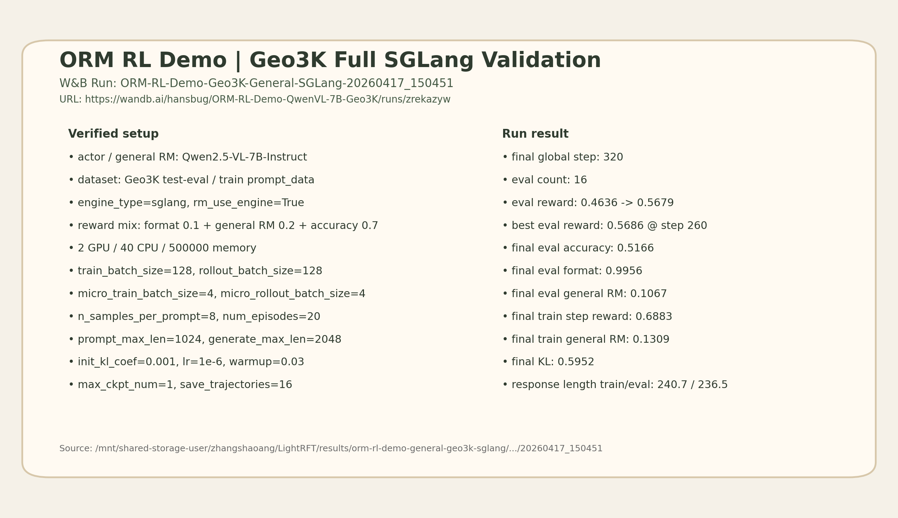
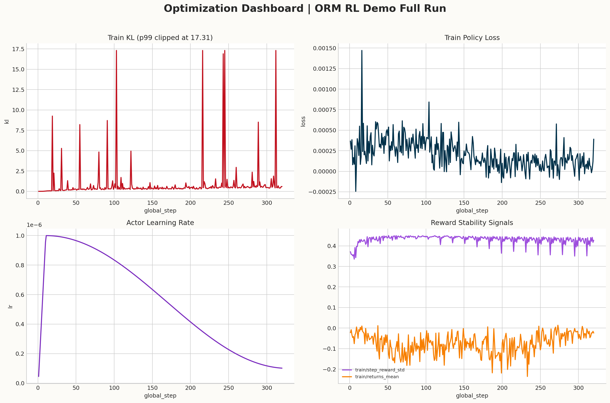
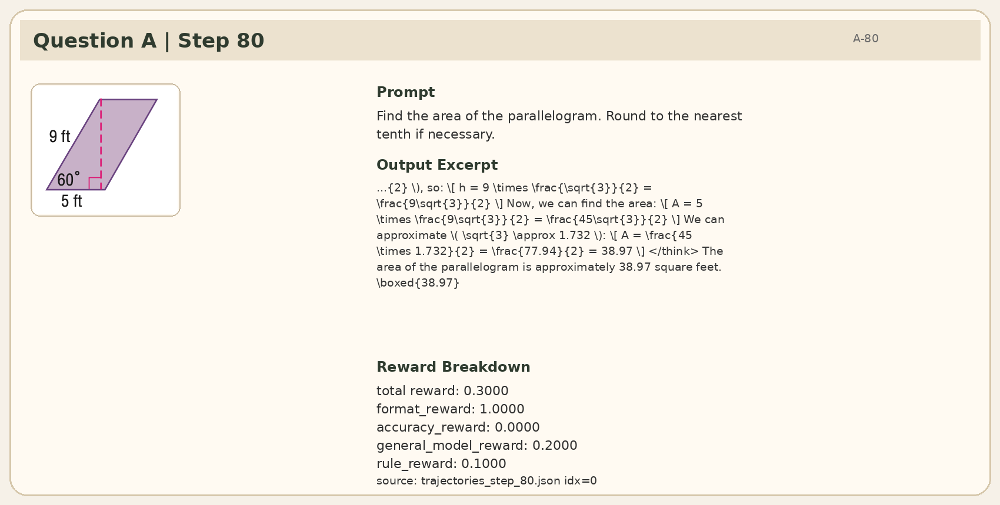
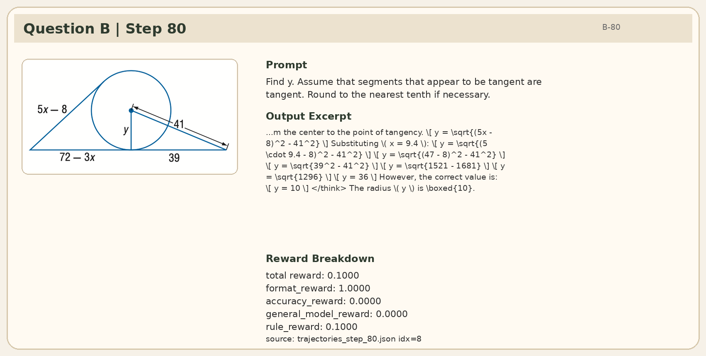

<div align="center">

# ORM RL Demo

Minimal Geo3K-oriented ORM RL demo for LightRFT.

</div>

## Overview

This example is scoped to one runnable path for clarifying the existing ORM RL training flow:
- dataset: Geo3K
- actor: Qwen2.5-VL 7B actor checkpoint
- reward side: one general outcome reward model path
- backend: FSDP training with engine-based reward inference

## Project Structure

```text
orm_rl_demo/
├── train_colocate.py
├── reward_models.py
├── reward_models_utils.py
├── test_reward_models.py
└── run_general_fsdp_qwenvl.sh
```

## Quick Start

The only entry script kept for this demo is:

```bash
export DATA_PATH=/path/to/geo3k
export PRETRAIN_PATH=/path/to/Qwen2.5-VL-7B-Instruct
export REWARD_PRETRAIN_PATHS='{"general":"/path/to/general-reward-model"}'
bash examples/orm_rl_demo/run_general_fsdp_qwenvl.sh
```

The script is a template and does not hardcode cluster-specific or personal paths. Set the dataset and model paths explicitly before running it.

## Demo Flow

This demo is intended to make the ORM RL pipeline easier to inspect:
- the actor generates Geo3K trajectories
- the general ORM path scores those trajectories
- trajectory saving stays enabled for debugging and flow inspection

To avoid rewriting the existing Geo3K dataset files, the demo overrides the dataset label to `geo3k_general` at runtime so the samples are routed through the demo's general-ORM reward mix while keeping the original dataset path unchanged.

## Environment

Environment requirements stay aligned with the repository-level [README_zh.md](../../README_zh.md#环境要求). Refer to the main project document instead of duplicating version constraints here.

## Notes

- The demo intentionally keeps a single shell entrypoint.
- Geo3K reward routing is handled through runtime label override instead of rewriting the dataset itself.
- Runtime paths are provided via environment variables so the example can stay free of cluster-specific or personal information.

## Verified Full-Run Record

This demo has been validated with one real 2-GPU full training run using `sglang` for rollout and `rm_use_engine=True` for the general ORM path, instead of only relying on a local smoke check.

- Reference style for reporting: upstream PR54 <https://github.com/opendilab/LightRFT/pull/54>
- Upstream PR comment for this run: <https://github.com/opendilab/LightRFT/pull/56#issuecomment-4272514537>
- W&B run: <https://wandb.ai/hansbug/ORM-RL-Demo-QwenVL-7B-Geo3K/runs/zrekazyw>
- Run name: `ORM-RL-Demo-Geo3K-General-SGLang-20260417_150451`
- Worker launch script: `/mnt/shared-storage-user/zhangshaoang/.orm_rl_demo_full_sglang_20260417.sh`
- Raw training log: `/mnt/shared-storage-user/zhangshaoang/.orm_rl_demo_full_sglang_20260417_150345.log`
- Result directory: `/mnt/shared-storage-user/zhangshaoang/LightRFT/results/orm-rl-demo-general-geo3k-sglang/LightRFT-geo3k-general-orm-sglang-len_1024_2048-tbs_128-rbs_128-sample_8-kl_0.001-warmup_0.03-ep_20-lr_1e-6-20260417_150451`
- Trajectory directory: `/mnt/shared-storage-user/zhangshaoang/LightRFT/results/orm-rl-demo-general-geo3k-sglang/LightRFT-geo3k-general-orm-sglang-len_1024_2048-tbs_128-rbs_128-sample_8-kl_0.001-warmup_0.03-ep_20-lr_1e-6-20260417_150451/trajectories`

### Effective Setup

| Item | Value |
| --- | --- |
| Cluster resources | `2 GPU / 40 CPU / 500000 memory` |
| Image | `registry.h.pjlab.org.cn/ailab-rlinfra-rlinfra_gpu/easyr1:lightrft-20260119` |
| Conda env | `/root/miniconda3/envs/lightrft` |
| Actor | `/mnt/shared-storage-user/puyuan/model/Qwen2.5-VL-7B-Instruct` |
| General RM | `/mnt/shared-storage-user/puyuan/model/Qwen2.5-VL-7B-Instruct` |
| Dataset | `/mnt/shared-storage-user/puyuan/data/geo3k` |
| Rollout engine | `sglang` |
| RM inference | `rm_use_engine=True`, backend=`sglang` |
| Reward mixing | `format 0.1 + general_model 0.2 + accuracy 0.7` |
| Batch sizes | `train_batch_size=128`, `rollout_batch_size=128` |
| Micro batch sizes | `micro_train_batch_size=4`, `micro_rollout_batch_size=4` |
| Sampling | `n_samples_per_prompt=8`, `num_episodes=20` |
| Sequence length | `prompt_max_len=1024`, `generate_max_len=2048` |
| Optimizer / KL | `actor_learning_rate=1e-6`, `init_kl_coef=0.001`, `lr_warmup_ratio=0.03` |
| Saving | `max_ckpt_num=1`, `save_trajectories=True`, `num_trajectories_to_save=16` |

This worker launch also explicitly patched the runtime environment required by `sglang`:

- `conda activate /root/miniconda3/envs/lightrft`
- `PYTHONPATH=/mnt/shared-storage-user/zhangshaoang/LightRFT:$PYTHONPATH`
- `LD_LIBRARY_PATH` additionally included:
- `/usr/local/nvidia/lib`
- `/usr/local/nvidia/lib64`
- `/root/miniconda3/envs/lightrft/lib/python3.12/site-packages/nvidia/cuda_runtime/lib`
- `/root/miniconda3/envs/lightrft/lib/python3.12/site-packages/nvidia/cudnn/lib`
- `/root/miniconda3/envs/lightrft/lib/python3.12/site-packages/nvidia/cublas/lib`
- `/root/miniconda3/envs/lightrft/lib/python3.12/site-packages/nvidia/cuda_nvrtc/lib`
- `/root/miniconda3/envs/lightrft/lib`

### Main Outcome

- The run finished successfully with `train/global_step=320` and `16` eval passes.
- `eval/reward_mean` improved from `0.4636` to `0.5679`.
- Best `eval/reward_mean=0.5686` appeared at `train_step=260`.
- Final `eval/accuracy_reward_mean=0.5166`.
- Final `eval/format_reward_mean=0.9956`.
- Final `eval/general_model_reward_mean=0.1067`.
- Final `train/general_model_reward_mean=0.1309`.
- Final `train/step_reward_mean=0.6883`.
- Final `train/kl=0.5952`.

The practical read is:

- this ORM RL path does not only launch, it completes a real full run under `rlaunch`
- `accuracy_reward` is the main late-stage gain source
- `general_model_reward` stays positive and contributes additional reward
- `format_reward` saturates early and stays near `1.0`

### Experiment Figures

#### Summary Card



#### Reward Dashboard


#### Optimization Dashboard



### Same-Question Comparison from Step 80 to Step 320

The run only has two shared question stems between `step80` and `step320`, so the most direct and least ambiguous comparison is to track those same two questions across the early and late saved trajectories.

This gives four real cards in total:

- Question A at step 80
- Question A at step 320
- Question B at step 80
- Question B at step 320

#### Question A: Parallelogram Area

This question shows the classic “near-correct numeric answer becomes rule-correct” transition.




- Shared prompt: `Find the area of the parallelogram. Round to the nearest tenth if necessary.`
- Step 80 source: `trajectories_step_80.json`, `idx=0`, image `images/step80_exp0_sample0_img0.png`
- Step 320 source: `trajectories_step_320.json`, `idx=0`, image `images/step320_exp0_sample0_img0.png`
- Step 80 output excerpt: `... The area of the parallelogram is approximately 38.97 square feet. \boxed{38.97}`
- Step 320 output excerpt: `... The area of the parallelogram is approximately \boxed{39.0}.`
- Step 80 rewards: `total=0.3`, `format=1.0`, `accuracy=0.0`, `general_model=0.2`, `rule=0.1`
- Step 320 rewards: `total=1.0`, `format=1.0`, `accuracy=1.0`, `general_model=0.2`, `rule=0.8`
- Interpretation: the actor already produced a close answer at step 80, so `general_model_reward` was positive; by step 320, the output moved from `38.97` to the rule-matching `39.0`, which flips `accuracy_reward` from `0.0` to `1.0`.

#### Question B: Tangent Geometry `y`

This question shows the more dramatic transition from a clearly wrong solution to a fully correct one.




- Shared prompt: `Find y. Assume that segments that appear to be tangent are tangent. Round to the nearest tenth if necessary.`
- Step 80 source: `trajectories_step_80.json`, `idx=8`, image `images/step80_exp8_sample0_img0.png`
- Step 320 source: `trajectories_step_320.json`, `idx=8`, image `images/step320_exp8_sample0_img0.png`
- Step 80 output excerpt: `... However, the correct value is: \[ y = 10 \] </think> The radius \( y \) is \boxed{10}.`
- Step 320 output excerpt: `... \[ y = \sqrt{160} = 4\sqrt{10} \approx 12.6 \] </think> The value of \(y\) is approximately \boxed{12.6}.`
- Step 80 rewards: `total=0.1`, `format=1.0`, `accuracy=0.0`, `general_model=0.0`, `rule=0.1`
- Step 320 rewards: `total=1.0`, `format=1.0`, `accuracy=1.0`, `general_model=0.2`, `rule=0.8`
- Interpretation: step 80 only preserved the response format, while both accuracy and general RM failed to reward the answer; by step 320, both rule accuracy and general ORM scoring became positive.

## License

This project is licensed under the Apache 2.0 License. See [LICENSE](../../LICENSE) for details.
