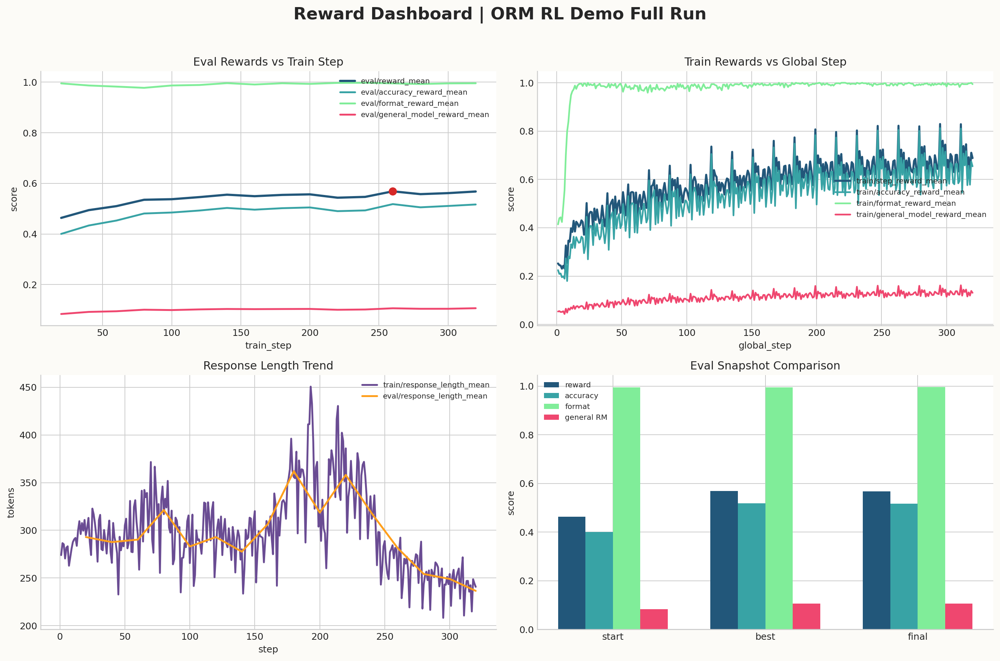
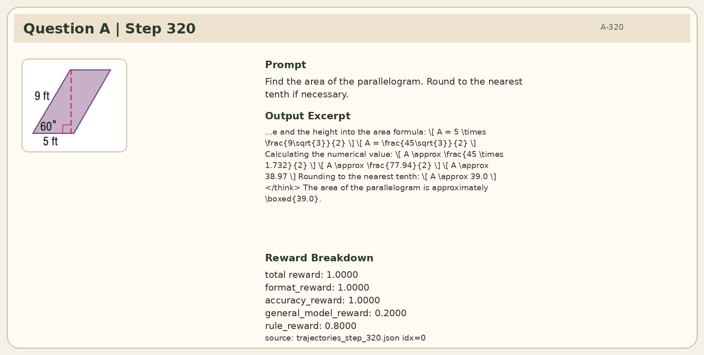
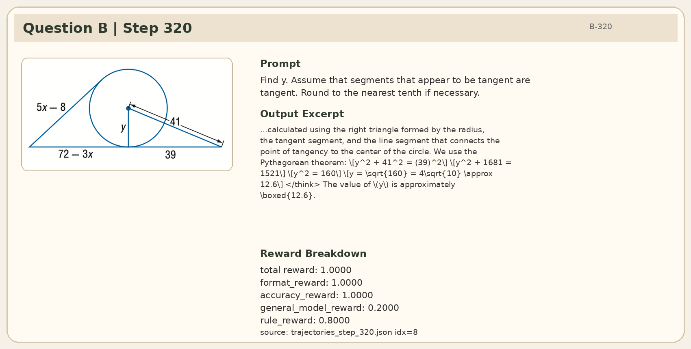

<div align="center">

# ORM RL Demo 训练示例

基于 Geo3K 的 ORM 轨迹打分 RL 训练完整 demo。

</div>

## 概述

本示例展示了使用 ORM 对轨迹打分进行 RL 训练的完整流程，包含以下配置：
- 数据集：Geo3K
- actor：Qwen2.5-VL 7B 模型
- reward：单个 general outcome reward model，与规则正确性奖励和格式奖励组合后共同计算 GRPO loss
- 训练引擎：FSDP，推理引擎：SGLang

训练时，actor 在 Geo3K 上生成轨迹，general ORM 对轨迹打分，与规则正确性奖励（`accuracy_reward`）和格式奖励（`format_reward`）三路混合后，共同计算 GRPO loss。为了不直接改写 Geo3K 数据集文件，本 demo 在运行时将数据标签覆盖为 `geo3k_general`，沿用原始数据路径的同时走 general ORM reward 融合逻辑。

环境要求与仓库根目录 [README_zh.md](../../README_zh.md#环境要求) 保持一致，请直接参考主文档。

## 项目结构

```text
orm_rl_demo/
├── train_colocate.py
├── reward_models.py
├── reward_models_utils.py
├── test_reward_models.py
└── run_general_fsdp_qwenvl.sh
```

## 快速开始

设置数据和模型路径后，运行入口脚本：

```bash
export DATA_PATH=/path/to/geo3k
export PRETRAIN_PATH=/path/to/Qwen2.5-VL-7B-Instruct
export REWARD_PRETRAIN_PATHS='{"general":"/path/to/general-reward-model"}'
bash examples/orm_rl_demo/run_general_fsdp_qwenvl.sh
```

运行前通过上述环境变量指定数据和模型路径。

## 实验结果

### 实验设置

本 demo 已通过一次真实的 2 卡全量训练验通（W&B run：[ORM-RL-Demo-QwenVL-7B-Geo3K](https://wandb.ai/hansbug/ORM-RL-Demo-QwenVL-7B-Geo3K/runs/zrekazyw)），关键配置如下：

| 项目 | 值 |
| --- | --- |
| Actor | Qwen2.5-VL-7B-Instruct |
| General RM | Qwen2.5-VL-7B general reward model |
| 数据 | Geo3K |
| 训练引擎 | FSDP |
| 推理引擎 | SGLang（`rm_use_engine=True`） |
| Reward 融合 | `format_reward × 0.1 + general_model_reward × 0.2 + accuracy_reward × 0.7` |
| Batch 大小 | `train_batch_size=128`, `rollout_batch_size=128` |
| 采样 | `n_samples_per_prompt=8`, `num_episodes=20` |
| 长度 | `prompt_max_len=1024`, `generate_max_len=2048` |
| 优化 / KL | `actor_learning_rate=1e-6`, `init_kl_coef=0.001`, `lr_warmup_ratio=0.03` |

三路奖励（规则正确性奖励 `accuracy_reward`、ORM 打分 `general_model_reward` 系数 0.2、格式奖励 `format_reward`）按上述权重混合，共同计算最终的 GRPO loss。其中 `general_model_reward` 对应的 0.2 是权重系数，ORM 模型本身的输出范围为 0.0 / 0.5 / 1.0，乘以 0.2 后得到 reward 贡献。

### 整体曲线结果

训练完整跑完（`train/global_step=320`，共 16 次 eval）：
- `eval/reward_mean` 从 `0.4636` 提升到 `0.5679`
- Best `eval/reward_mean=0.5686`，出现在 `train_step=260`
- Final `eval/accuracy_reward_mean=0.5166`，`eval/format_reward_mean=0.9956`，`eval/general_model_reward_mean=0.1067`





### 案例分析

Step 80 和 Step 320 之间共有 2 道题目重叠，以下展示这 2 道题从早期到末期的真实对照。

#### Question A：平行四边形面积题




- Step 80 reward：`total=0.3`，`format=1.0`，`accuracy=0.0`，`general_model=0.2`，`rule=0.1`
- Step 320 reward：`total=1.0`，`format=1.0`，`accuracy=1.0`，`general_model=0.2`，`rule=0.8`
- 含义：step 80 时 actor 答案已很接近，ORM 打出 1.0，乘系数 0.2 后贡献 0.2；到 step 320 时，输出从 `38.97` 修正为规则答案 `39.0`，`accuracy_reward` 从 `0.0` 跳至 `1.0`。

#### Question B：切线几何 `y`




- Step 80 reward：`total=0.1`，`format=1.0`，`accuracy=0.0`，`general_model=0.0`，`rule=0.1`
- Step 320 reward：`total=1.0`，`format=1.0`，`accuracy=1.0`，`general_model=0.2`，`rule=0.8`
- 含义：step 80 时只保住了格式，accuracy 和 general RM 均未给分；到 step 320 时，两项均变为正向贡献。

## 许可证

本项目采用 Apache 2.0 许可证。详见 [LICENSE](../../LICENSE)。
